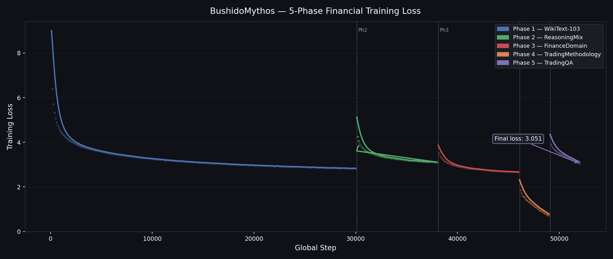

# BushidoMythos

<p align="center">
  
</p>

<p align="left">
  <a href="https://pypi.org/project/bushido-mythos/" target="_blank">
    <picture>
      <source srcset="https://img.shields.io/pypi/v/bushido-mythos?style=for-the-badge&color=3670A0" media="(prefers-color-scheme: dark)">
      
    </picture>
  </a>
  <a href="https://pytorch.org" target="_blank">
    <picture>
      <source srcset="https://img.shields.io/badge/PyTorch-Implemented-EE4C2C?style=for-the-badge&logo=pytorch&logoColor=white" media="(prefers-color-scheme: dark)">
      
    </picture>
  </a>
</p>

> **Fork Notice:** BushidoMythos is a fork of [OpenMythos](https://github.com/OpenMythos/OpenMythos). The original architecture — Recurrent-Depth Transformer, MoE FFN, MLA attention, ACT halting, LTI-stable injection, and LoRA depth adaptation — was designed by the OpenMythos project. This repository extends and specializes that foundation for financial-trading research. See [Changes from OpenMythos](#changes-from-openmythos) for the full list of modifications.

> **Disclaimer:** BushidoMythos is a research codebase for financial-trading language models. It is not investment advice, an investment recommendation system, or an automated trading system. Any real-market use requires independent validation, risk management, and compliance review.

> **About the Author:** This project was created by a Japanese samurai. It brings the spirit of Bushido, including sincerity, respect, courage, and righteousness, into machine-learning research, forging each line of code with the same care used to forge a blade.

BushidoMythos is an open-source Recurrent-Depth Transformer (RDT) designed for financial-trading research. Inspired by the decision-making philosophy of Bushido, it is intended to observe markets calmly, reason about risk before action, avoid impulsive overtrading, and explain decisions in terms of evidence, uncertainty, and downside risk.

The architecture has three stages: **Prelude** standard Transformer blocks, a looped **Recurrent Block** repeated up to `max_loop_iters`, and a final **Coda**. Attention can switch between MLA and GQA, and the recurrent feed-forward path uses sparse MoE with routed experts and shared experts.

In this fork, ACT and MoE are interpreted through a financial-trading lens. ACT halting is useful because simple prompts should not consume the same compute as multi-factor market scenarios involving macro catalysts, volatility, position sizing, and invalidation conditions. MoE routing is useful for exploring whether different expert subsets can specialize toward different market regimes, such as trend-following, range-bound behavior, risk-off shocks, earnings reactions, or sentiment-driven moves.

**Primary use cases:**

- Market commentary and scenario analysis
- Strategy research and trade-plan critique
- Risk-management reasoning, including position sizing and invalidation conditions
- Interpretation of financial documents and news
- Post-trade review and discipline-focused journaling

---

## Changes from OpenMythos

This section lists the major modifications and additions made on top of the original OpenMythos codebase.

### Bug fixes

| File | Location | Issue | Fix |
|---|---|---|---|
| `bushido_mythos/main.py` | `apply_rope()` | `reshape(..., -1, 2)` raised `RuntimeError` when the sequence-length dimension was 0 (T=0 at inference start) because PyTorch cannot resolve `-1` for a zero-element tensor | Replaced `-1` with the explicit value `x.shape[-1] // 2` |
| `bushido_mythos/main.py` | `GQAttention.forward()` (×2) | Same ambiguous `-1` in `.view(B, T, -1)` calls | Replaced with `.view(B, T, self.n_heads * self.head_dim)` |
| `bushido_mythos/main.py` | `MLAttention.forward()` | Same ambiguous `-1` in `.view(B, T, -1)` call | Replaced with `.view(B, T, self.n_heads * self.v_dim)` |
| `bushido_mythos/main.py` | `BushidoMythos.forward()` | No guard against empty input (T=0) — produced uninformative downstream errors | Added `ValueError` with diagnostic message when T=0 at the entry point of `forward()` |
| `bushido_mythos/main.py` | `_generate_inner()` | Empty `input_ids` (T=0) propagated silently to `logits[:, -1, :]`, raising an opaque `IndexError` | Added `ValueError` guard for `prompt_len == 0` and `RuntimeError` guard for `logits.shape[1] == 0` with full diagnostic context |

### New features

#### Financial domain training pipeline (`training/finance_pretrain.py`)

BushidoMythos adds a dedicated 5-phase training pipeline for financial-trading adaptation:

| Phase | Dataset | Purpose |
|---|---|---|
| **1** | WikiText-103 (~115M tokens) | General-language fluency and grammar grounding |
| **2** | OpenWebMath + Orca Math + optional Dolly | Quantitative reasoning, stepwise decomposition, logical structure |
| **3** | Financial news + finance-alpaca | Financial-domain vocabulary, instruction-response formatting |
| **4** | Optional FinGPT forecaster + sentiment experiment | Disabled by default after both controlled variants degraded broad Finance QA |
| **5** | Audited local Finance QA pilot | Risk-management and calculation SFT; disabled pending adoption |

From Phase 3 onward, SFT-style data is formatted as:

```text
### Instruction:
...

### Response:
...
```

This format guides the model toward structured, uncertainty-aware, risk-aware financial reasoning rather than raw text continuation. It is not present in the original OpenMythos codebase.

#### Gradient checkpointing (`use_gradient_checkpointing`)

`MythosConfig` gains a new field:

```python
use_gradient_checkpointing: bool = False
```

When `True`, each iteration of the recurrent loop is wrapped with `torch.utils.checkpoint.checkpoint(use_reentrant=False)`. Activation memory within the loop scales from **O(N)** to **O(1)** relative to `max_loop_iters`, at the cost of roughly 30–40% additional compute from recomputation.

Checkpointing is automatically suppressed when:
- `self.training` is `False` (eval / inference mode), or
- `kv_cache is not None` (the cache dict is mutated in-place and must not be re-executed on the backward recompute pass).

Enable in the training script with `--grad_checkpoint`:

```bash
python training/finance_pretrain.py --grad_checkpoint ...
```

Enable in the Colab notebook by setting `USE_GRAD_CHECKPOINT = True` in the GPU-settings cell.

#### Memory-efficient attention and decoding

Both GQA and MLA use PyTorch scaled dot-product attention (SDPA) as the standard
fallback. On supported CUDA builds, PyTorch selects a fused attention backend;
otherwise it uses its compatible math implementation. The model also passes the
causal condition directly to SDPA during training and prompt prefill, avoiding a
separate `T x T` additive mask in the common path.

Autoregressive generation uses a capacity-aware KV cache sized for the prompt and
requested output. New tokens are written into reserved storage instead of rebuilding
every layer's cache with `torch.cat()` at each decode step. The generation path also
projects only the final hidden position through the vocabulary head. Regular
`forward()` calls still return logits for every input position by default; callers
that only need a suffix can pass `logits_to_keep=N`.

All K/V tensors written into the cache — including those from the current forward —
are stored detached, so a forward pass that uses a KV cache does not propagate
gradients through the cached attention keys and values. (The previous `torch.cat()`
implementation kept the current step's gradient path.) This is irrelevant for the
standard training pipeline, which runs with `kv_cache=None`; it only matters for
hypothetical cache-enabled training setups.

These optimizations do not change model weights or sampling behavior. Their impact is
largest for long contexts and long generated outputs. Benchmark on the deployment GPU,
because the selected SDPA backend depends on the installed PyTorch and CUDA versions.

#### Standalone inference script (`chat.py`)

A new top-level script [`chat.py`](chat.py) provides an interactive REPL for trained checkpoints. Key capabilities:

- Automatic checkpoint selection (temporary quality-safe priority: `phase3_final.pt` → `phase5_final.pt` → `phase4_final.pt` → … → latest `step_*.pt`)
- `--finance_mode`: wraps user input in `### Instruction: / ### Response:` format with a risk-aware suffix
- `--tokenizer auto / gpt2 / mythos`: tokenizer selection with verified GPT-2 loading (tests actual encoding before accepting the tokenizer)
- Prompt truncation: left-side truncation keeps the most recent context when the prompt exceeds `max_seq_len - max_new_tokens`
- `--rep_penalty`: repetition penalty (HuggingFace style)
- `--grouped_moe`: opt-in native BF16 grouped MoE on CUDA SM80+; explicit requests fail instead of falling back silently
- `--dtype`: keeps legacy FP32 by default; `--grouped_moe --dtype auto` selects BF16 autocast

```bash
python chat.py --finance_mode --ckpt_dir checkpoints/finance_a100_v2 --temp 0.6 --top_k 40
```

Batch-1 chat generation has a separate benchmark because training throughput does not predict incremental decode performance:

```bash
python3 training/bench_chat_grouped_moe.py \
  --ckpt checkpoints/finance_a100_v2/phase5_final.pt \
  --prompt_len 64 --max_new_tokens 32 --n_loops 4 \
  --warmup 3 --repeats 5 \
  --json_out checkpoints/finance_a100_v2/bench_chat_grouped_moe.json
```

On A100 with batch 1, prompt length 64, 32 generated tokens, and 4 recurrent loops, legacy produced 46.82 generated tokens/sec at 461.1 MiB peak allocation. Grouped MoE produced 37.51 tokens/sec at 547.9 MiB: **0.801x speedup (19.9% slower) and 86.8 MiB more memory**. Output token IDs matched exactly. The grouped path remains useful for training-sized token batches, but `chat.py` keeps legacy FP32 as the recommended default for interactive decode. `--grouped_moe` remains opt-in for future batched-serving measurements.

#### Verified GPT-2 tokenizer loading (`colab_finance_train.ipynb`)

The inference cell now uses a `load_verified_gpt2_tokenizer()` helper that:

1. Tries four loading strategies in order: `AutoTokenizer (local_files_only=True)`, `GPT2TokenizerFast (local_files_only=True)`, network fallbacks for both.
2. Validates each candidate by encoding the string `"Hello"` and checking the result is non-empty.
3. If all strategies fail, raises a `RuntimeError` with cache-clear instructions.

This prevents the silent failure mode where a corrupted Hugging Face cache returns a tokenizer that encodes every string to an empty list.

#### Tokenizer clamping

Token IDs returned by the GPT-2 tokenizer are clamped to `[0, cfg.vocab_size - 1]` before being passed to the model embedding table, guarding against out-of-range IDs when the tokenizer vocabulary slightly exceeds the model vocabulary.

### Training script additions (`training/finance_pretrain.py`)

| Flag | Description |
|---|---|
| `--grad_checkpoint` | Enable gradient checkpointing in the recurrent loop |

The `--grad_checkpoint` value always overrides whatever was stored in the checkpoint's `cfg` to prevent accidentally inheriting a stale setting on resume.

### Colab notebook additions (`colab_finance_train.ipynb`)

| Addition | Description |
|---|---|
| `USE_GRAD_CHECKPOINT = False` | Toggle in the GPU-settings cell; set to `True` when OOM |
| SDPA capability check | Prints whether the installed PyTorch exposes scaled dot-product attention; no extra flag is required |
| Memory-efficient inference note | Documents reserved KV cache storage and final-position-only vocabulary projection used by `model.generate()` |
| Auto-creation of base checkpoint | `run-both` and `run-phase1` cells call `make_base_ckpt.py` automatically if the starting checkpoint is missing (e.g., after a Drive disconnect) |
| Phase pre-checks | Phase 2–5 cells verify that the previous phase's `*_final.pt` exists before starting, and raise a clear `FileNotFoundError` with remediation instructions if it is missing |

### Test additions (`tests/test_main.py`)

`TestGradientCheckpointing` — 11 new test cases:

| Test | What it checks |
|---|---|
| `test_config_default_false` | Flag defaults to `False` |
| `test_config_can_enable` | Flag can be set to `True` |
| `test_train_forward_matches_baseline` | Forward output is bit-identical with and without checkpointing |
| `test_no_nan_with_checkpointing` | No NaN in output |
| `test_backward_completes` | Backward pass does not raise |
| `test_gradients_match_baseline` | Gradients are numerically close to standard backprop |
| `test_inactive_at_eval` | Suppressed in eval mode |
| `test_inactive_with_kv_cache` | Suppressed when `kv_cache` is provided |
| `test_mla_mode_forward_and_backward` | Works with MLA attention |
| `test_with_loop_curriculum` | Compatible with random-depth training |
| `test_with_act_aux_loss` | ACT auxiliary loss still computed correctly |

---

## Installation

```bash
pip install bushido-mythos

# uv pip install bushido-mythos
```

To enable Flash Attention 2 in `GQAttention` (requires CUDA and build tools):

```bash
pip install bushido-mythos[flash]
```

---

## Usage

```python
import torch
from bushido_mythos.main import BushidoMythos, MythosConfig

attn_type = "mla"  # or "gqa"

base = {
    "vocab_size": 1000,
    "dim": 256,
    "n_heads": 8,
    "max_seq_len": 128,
    "max_loop_iters": 4,
    "prelude_layers": 1,
    "coda_layers": 1,
    "n_experts": 8,
    "n_shared_experts": 1,
    "n_experts_per_tok": 2,
    "expert_dim": 64,
    "lora_rank": 8,
    "attn_type": attn_type,
}

if attn_type == "gqa":
    cfg = MythosConfig(**base, n_kv_heads=2)
else:
    cfg = MythosConfig(
        **base,
        n_kv_heads=8,
        kv_lora_rank=32,
        q_lora_rank=64,
        qk_rope_head_dim=16,
        qk_nope_head_dim=16,
        v_head_dim=16,
    )

model = BushidoMythos(cfg)
total = sum(p.numel() for p in model.parameters())
print(f"\n[{attn_type.upper()}] parameter count: {total:,}")

ids = torch.randint(0, cfg.vocab_size, (2, 16))
logits = model(ids, n_loops=4)
print(f"[{attn_type.upper()}] logits shape: {logits.shape}")

out = model.generate(ids, max_new_tokens=8, n_loops=8)
print(f"[{attn_type.upper()}] generated shape: {out.shape}")

A = model.recurrent.injection.get_A()
rho = torch.linalg.eigvals(A).abs().max().item()
print(f"[{attn_type.upper()}] spectral radius rho(A) = {rho:.4f} (should be < 1)")
```

---

## Model Variants

Preset configurations from 1B to 1T parameters:

```python
from bushido_mythos import (
    mythos_1b,
    mythos_3b,
    mythos_10b,
    mythos_50b,
    mythos_100b,
    mythos_500b,
    mythos_1t,
    BushidoMythos,
)

cfg = mythos_3b()  # returns MythosConfig
model = BushidoMythos(cfg)

total = sum(p.numel() for p in model.parameters())
print(f"parameter count: {total:,}")
```

| Variant | `dim` | Experts | `expert_dim` | Loops | Context | Max Output |
|---|---|---|---|---|---|---|
| `mythos_1b` | 2048 | 64 | 2048 | 16 | 4k | 4k |
| `mythos_3b` | 3072 | 64 | 4096 | 16 | 4k | 4k |
| `mythos_10b` | 4096 | 128 | 5632 | 24 | 8k | 4k |
| `mythos_50b` | 6144 | 256 | 9728 | 32 | 8k | 4k |
| `mythos_100b` | 8192 | 256 | 13568 | 32 | 1M | 128k |
| `mythos_500b` | 12288 | 512 | 23040 | 48 | 1M | 128k |
| `mythos_1t` | 16384 | 512 | 34560 | 64 | 1M | 128k |

---

## Training

For local smoke testing, start with the small scripts:

```bash
python3.9 training/train_tiny.py --dataset synthetic --steps 100
python3.9 training/pretrain_laptop.py --model tiny --steps 100 --seq_len 64 --micro_batch 1
```

The large 3B pretraining script is available at [`training/3b_fine_web_edu.py`](training/3b_fine_web_edu.py). It is useful for general-language grounding, but a trading-specialized model should add domain-adaptation phases after pretraining.

**Single GPU:**

```bash
python training/3b_fine_web_edu.py
```

**Multi GPU (auto-detect GPU count):**

```bash
torchrun --nproc_per_node=$(python -c "import torch; print(torch.cuda.device_count())") training/3b_fine_web_edu.py
```

**Main design choices:**

| Item | Details |
|---|---|
| Optimizer | AdamW |
| General dataset | `HuggingFaceFW/fineweb-edu` for broad language grounding |
| Trading specialization | Market-data text, financial news, filings, macro indicators, strategy notes, risk-management examples, and post-trade reviews |
| Tokenizer | `openai/gpt-oss-20b` through `MythosTokenizer`, loaded only when explicitly requested |
| Parallelism | PyTorch DDP through `torchrun`, with sharded streaming datasets |
| Precision | bfloat16 on H100/A100; float16 + GradScaler on older GPUs |
| Schedule | Linear warmup for 2000 steps, then cosine decay |
| MoE balancing | DeepSeek-V3 router bias, updated after each optimizer step |
| ACT auxiliary loss | Ponder-cost penalty, enabled with `--act_aux_loss_weight` |
| Loop curriculum | Variable-depth (random recurrence) training, enabled with `--loop_schedule curriculum` in `finance_pretrain.py` |

### Financial Domain Pretraining

[`training/finance_pretrain.py`](training/finance_pretrain.py) is a five-phase staged training pipeline that continues from an existing checkpoint.

| Phase | Dataset | Default Steps | Purpose |
|---|---|---|---|
| **Phase 1** | WikiText-103 (about 115M tokens) | 20,000 | General-language fluency |
| **Phase 2** | `open-web-math/open-web-math` + `microsoft/orca-math-word-problems-200k` + `databricks/databricks-dolly-15k` | 8,000 | Reasoning reinforcement: quantitative reasoning, stepwise decomposition, and logical explanatory structure |
| **Phase 3** | `ashraq/financial-news-articles` + `gbharti/finance-alpaca` | 8,000 | Financial-domain vocabulary and instruction-response formatting |
| **Phase 4** | Optional FinGPT forecaster/sentiment task-specific SFT | 0 | Disabled by default: forecaster-only and balanced-sentiment pilots both degraded held-out broad Finance QA |
| **Phase 5** | Local audited risk-management/calculation SFT; FIQA is an opt-in comparison source | 0 | Disabled until the curated 500-step pilot passes the held-out adoption gate |

Phase 3 and later use a fixed prompt format:

```text
### Instruction:
Explain risk management in trading.

### Response:
(model-generated answer)
```

**Basic usage:**

```bash
# Run the safe default schedule (Phase 1 -> 3; Phases 4-5 are disabled)
python3.9 training/finance_pretrain.py --phase 0

# Resume after interruption from the latest step_*.pt in --ckpt_dir
python3.9 training/finance_pretrain.py --auto_resume

# Phase 3 only, after Phase 2 completes
python3.9 training/finance_pretrain.py \
  --phase 3 \
  --resume checkpoints/finance_a100_v2/phase2_final.pt

# Phase 4 only, after Phase 3 completes
python3.9 training/finance_pretrain.py \
  --phase 4 \
  --resume checkpoints/finance_a100_v2/phase3_final.pt

# Low-level controlled Phase 5 pilot (the dedicated runner below is preferred)
python3.9 training/finance_pretrain.py \
  --phase 5 \
  --resume checkpoints/finance_a100_v2/phase3_final.pt \
  --phase5_steps 500 --phase5_data_mode curated
```

**Recommended Google Colab setup:** save checkpoints to Google Drive to avoid losing data when a session disconnects. The Drive path is controlled by the `REPO` variable near the top of the notebook, so adjust it for your environment, such as `MyDrive/OpenMythos-main` or `Othercomputers/My Mac/OpenMythos-main`.

```bash
python training/finance_pretrain.py \
  --base_ckpt /content/drive/<Drive path>/checkpoints/a100_v2_gpt2vocab/final.pt \
  --ckpt_dir  /content/drive/<Drive path>/checkpoints/finance_a100_v2 \
  --local_ckpt_dir /content/checkpoints/finance_a100_v2 \
  --cache_dir /content/cache \
  --batch_size 64 --seq_len 1024 \
  --dtype auto --auto_resume
```

`--cache_dir /content/cache` stores tokenized data on Colab's fast NVMe storage. It is rebuilt in about two minutes in a new session. Putting the cache on Drive can skip regeneration, but Drive writes are slower.

To start a complete new training run, use a new empty `--ckpt_dir`/`--local_ckpt_dir` pair. Deleting tokenized datasets does not reset training because `--auto_resume` is controlled by checkpoints, not the dataset cache. The Colab notebook uses `FRESH_RUN_NAME = "finance_a100_v3_full"`; keep that name when resuming an interrupted v3 run, and increment it only when intentionally starting another run from phase 1. Existing v2 checkpoints remain available as the comparison baseline.

**Main options:**

| Flag | Default | Description |
|---|---|---|
| `--base_ckpt` | `checkpoints/a100_v2_gpt2vocab/final.pt` | Starting checkpoint. If missing, the config can be borrowed from `--resume` |
| `--ckpt_dir` | `checkpoints/finance_a100_v2` | Checkpoint output directory |
| `--local_ckpt_dir` | unset | Write checkpoints atomically to this local directory, then copy them asynchronously to `--ckpt_dir`. Intended for Colab NVMe plus Drive |
| `--keep_local_completed` | `1` | Number of successfully copied periodic `step_*.pt` files retained locally. Phase/final checkpoints are not removed |
| `--wall_clock_json` | unique file under `<ckpt_dir>` | Atomic JSON report for total/phase wall-clock, dataset build, data wait, optimizer, checkpoint serialization, and asynchronous copy metrics. The default name includes phase, measured step range, and process start time so resumed segments are not overwritten |
| `--phase` | `0` | `0` = all phases / `1` to `5` = one phase only |
| `--phase1_steps` | `20000` | Phase 1 step count |
| `--phase2_steps` | `8000` | Phase 2 step count for reasoning reinforcement |
| `--phase3_steps` | `8000` | Phase 3 step count for finance domain + instruction format |
| `--phase4_steps` | `0` | Optional task-specific Phase 4 steps. Broad Finance QA pilots do not justify enabling it |
| `--phase4_sentiment_ratio` | `0.0` | Maximum sentiment rows relative to forecaster rows. `0` = forecaster-only, `1` = equal counts, `-1` = all sentiment rows |
| `--phase4_unbalanced_sentiment` | `False` | Disable round-robin response-label balancing for the selected sentiment rows |
| `--phase4_max_response_share` | `0.20` | Stop before training if one exact Phase 4 response exceeds this fraction of examples |
| `--phase5_steps` | `0` | Phase 5 step count; assign explicitly only for a controlled pilot |
| `--phase5_data_mode` | `curated` | `curated`, `fiqa`, or `mixed`; remote FIQA modes are explicit comparisons |
| `--phase5_curated_path` | `training/train_data/finance_qa_curated_v2_train.json` | Family-disjoint project-authored Phase 5 training examples |
| `--phase5_validation_path` | `training/eval_data/finance_qa_curated_v2_validation.json` | Validation split used for leakage auditing; it is never added to training batches |
| `--phase5_eval_suite` | `training/eval_data/finance_qa_v2.json` | Held-out suite used only to reject lexical overlap |
| `--phase5_max_similarity` | `0.80` | Reject train/eval instruction or response pairs at or above this lexical similarity |
| `--phase5_max_response_share` | `0.10` | Reject data when one exact answer exceeds this share |
| `--phase5_audit_json` | `<ckpt_dir>/phase5_data_audit.json` | Train/validation source hashes, family separation, response profile, and held-out overlap evidence |
| `--auto_resume` | `False` | Automatically resume from the latest `step_*.pt` in `--ckpt_dir` |
| `--batch_size` | `4` | Microbatch size |
| `--grad_accum_steps` | `1` | Gradient accumulation steps. Effective batch = `batch_size x grad_accum_steps` (`>= 1`) |
| `--seq_len` | `1024` | Sequence length |
| `--dtype` | `auto` | `auto` = bfloat16 on Ampere+ (A100), float16 on T4/V100, float32 on CPU/MPS |
| `--compile` | `False` | Uses `torch.compile()` on Ampere+; measured steady-state gain is about 7.5% for A100/batch 16/seq 256/8 loops with gradient checkpointing. Unsupported environments are skipped automatically |
| `--grad_checkpoint` | `False` | Enable gradient checkpointing in the recurrent loop. Reduces activation memory in proportion to loop depth (larger effect with more loops) at the cost of ~30-40% extra compute |
| `--ce_chunk_size` | `0` | Checkpoint tied LM-head cross entropy in token chunks, avoiding retention of full `(B,T,vocab)` logits. `0` disables it; benchmark `1024` first because backward recomputes the LM head |
| `--liger_fused_ce` | `False` | Require Liger fused linear cross entropy on CUDA, avoiding full LM-head logits without chunk recomputation. Mutually exclusive with `--ce_chunk_size`; unavailable requests fail immediately |
| `--grouped_moe` | `False` | Require native BF16 grouped GEMM for routed experts on CUDA SM80+ with PyTorch 2.11+. Prints active status/reason and exits if requested but unavailable; omission retains the legacy expert loop |
| `--optim8bit` | `False` | Require bitsandbytes 8-bit AdamW (optimizer states 8→2 bytes/param, near-lossless). Requires CUDA + `pip install bitsandbytes`; unavailable requests fail immediately instead of falling back. Resume must use the same setting (a mismatch resets optimizer state with a warning) |
| `--fused_optimizer` | `False` | Require CUDA `torch.optim.AdamW(fused=True)`. Mutually exclusive with `--optim8bit`; unsupported devices fail immediately instead of falling back. Uses fp32 optimizer states, so compare VRAM as well as speed |
| `--mem_log_every` | `100` | Log VRAM stats (`alloc` / `reserved` / `peak` / `frag`) every N steps. Helps diagnose OOM root cause. `0` = disable |
| `--loop_schedule` | `off` | Recurrent-depth control (experimental). `off` = model default / `fixed` = pin `n_loops` to `max_loop_iters` (clean baseline) / `curriculum` = phase-based variable recurrence (see below) |
| `--loop_tail_max` | `12` | `curriculum`: max loops in the upward tail (Phase 2+). Set the base checkpoint's `max_loop_iters` to this value so the tail gets its own depth-LoRA |
| `--loop_tail_p` | `0.2` | `curriculum`: probability of sampling the tail (`hi+1..loop_tail_max`) |
| `--loop_seed` | `0` | `curriculum`: sampler seed; deterministic per `(seed, step)` so it is resume-safe |
| `--replay_ratio` | `0.0` | Memory replay (anti-forgetting, experimental): in Phase 2+, replace this fraction of batches with a general-language (WikiText-103) anchor. Replay *replaces* (not adds) batches, so effective domain steps shrink — raise total steps to compensate. Pilot: 20% replay cut catastrophic forgetting ~89% while finance held-out PPL improved; sweet spot 5–10% (see `training/exp_replay_pilot.py`) |
| `--act_curriculum` | `False` | Ramp `act_threshold`/`act_aux_loss_weight` (ponder cost) from shallow to deep over training instead of holding them fixed (experimental, see below). Compatible with `--compile` through compile-safe scalar tensor buffers |
| `--act_threshold_start` | `0.5` | `act_curriculum`: starting ACT threshold (must be in `(0, 1]`) |
| `--act_threshold_end` | `-1.0` | `act_curriculum`: ending ACT threshold; `-1` resolves to the model's `cfg.act_threshold` |
| `--act_warmup_frac` | `0.5` | `act_curriculum`: fraction of the run (relative to `--act_anchor_step`) over which the ramp completes; must be in `[0, 1]` |
| `--ponder_weight_start` | `0.0` | `act_curriculum`: starting ponder-cost weight (must be `>= 0`) |
| `--ponder_weight_end` | `0.0` | `act_curriculum`: ending ponder-cost weight (must be `>= 0`) |
| `--act_anchor_step` | `-1` | `act_curriculum`: step the ramp's progress is measured from. `-1` = auto (the resume step). When phases run as separate processes (e.g. Colab cells), pass the same explicit fixed value (e.g. `0`) on every phase to keep the ramp continuous instead of resetting each phase — see [`training/report/act_curriculum_design.md`](training/report/act_curriculum_design.md) |
| `--lr` | `1e-4` | Peak learning rate |
| `--save_every` | `2000` | Checkpoint interval in steps |
| `--keep_last_n_steps` | `3` | Keep only the last N `step_*.pt` checkpoints in `--ckpt_dir`; older ones are deleted automatically right after each save to bound disk usage. Does not touch `phaseN_final.pt`/`final.pt`. `<= 0` disables rotation (keep all) |

Checkpoints save `scheduler_state`, `scaler_state` for float16 training, and phase metadata, so interrupted runs can resume with the same schedule. A phase is skipped automatically if the current step has already passed its endpoint. With `--local_ckpt_dir`, one background worker copies completed local files to `--ckpt_dir` through a temporary file and atomic rename. Periodic copies may overlap training; every phase-final checkpoint is flushed to the durable directory before the phase is reported complete. The log prints queue depth, serialization time, copy time, and copy failures. Normal process exit, `KeyboardInterrupt`, and uncaught Python exceptions flush pending copies through an exit hook. A hard Colab runtime loss can still discard files that were logged as pending.

Summarize completed phase reports without treating background copy time as foreground training time:

```bash
python3 training/report_wall_clock.py \
  checkpoints/finance_a100_v2/wall_clock_phase*.json \
  --json_out checkpoints/finance_a100_v2/wall_clock_summary.json
```

For an A/B comparison, run the same phase, step range, batch configuration, runtime switches, and checkpoint cadence once with direct Drive writes and once with `--local_ckpt_dir`. Then compare the two reports with the direct run first:

```bash
python3 training/report_wall_clock.py \
  checkpoints/direct/wall_clock_phase1.json \
  checkpoints/async/wall_clock_phase1.json \
  --labels direct async --compare \
  --json_out checkpoints/wall_clock_compare.json
```

Comparison fails if phase/token signatures or material runtime settings differ. It also rejects asynchronous reports with pending copies or recorded copy errors. `wall_clock_speedup` and effective tokens/sec are the adoption metrics; `copy_seconds` is reported separately because much of it can overlap training.

**Loop curriculum (`--loop_schedule curriculum`, experimental):**

A Recurrent-Depth Transformer runs the recurrent block `n_loops` times, so compute scales with loop count. Training at a variable (often lower) recurrence saves compute and, when an upward tail is included, teaches the model to extrapolate to deeper inference loops (test-time scaling). The schedule:

| Phase | Loop range | Tail (`hi+1..loop_tail_max`) |
|---|---|---|
| Phase 1 (first half) | 1–4 | off |
| Phase 1 (second half) | 2–8 | off |
| Phase 2 onward | 4–8 | sampled with prob `loop_tail_p` |

`fixed`/`curriculum` pass `n_loops` explicitly, overriding the model's internal `cfg.loop_curriculum` sampling. Evaluation should stay at a fixed depth (`eval_perplexity.py --n_loops`, `eval_finance_behavior.py --loops`) and can sweep `4/8/12/16` to measure depth scaling. To give the tail (9–12) its own depth-specific LoRA, build the base checkpoint with a matching `max_loop_iters` (e.g. `make_base_ckpt.py --max_loop_iters 12`). The full plan is in [`training/report/a100_experiment_plan.md`](training/report/a100_experiment_plan.md).

**ACT curriculum (`--act_curriculum`, experimental):**

Holding `act_threshold` fixed for the whole run lets the model halt deep recurrence early before it has learned to use it ("loop collapse"). The curriculum instead ramps `act_threshold` low→high (shallow→deep) and `ponder_weight` high→low over the first `--act_warmup_frac` of training, then holds at the end values:

| Progress (since `--act_anchor_step`) | `act_threshold` | `ponder_weight` |
|---|---|---|
| 0% | `--act_threshold_start` | `--ponder_weight_start` |
| 0–100% of warmup | linear ramp | linear ramp |
| ≥ `--act_warmup_frac` | `--act_threshold_end` (held) | `--ponder_weight_end` (held) |

Progress is measured from `--act_anchor_step`, not from absolute step 0 — this matters because each phase is normally launched as a separate process (a Colab cell) that resumes from a checkpoint, so the anchor must be a fixed value shared across all phase cells (e.g. `0` for a full run) to get one continuous ramp instead of the curriculum restarting every phase. `--act_threshold_end -1` (default) resolves to the model's own `cfg.act_threshold`.

`--act_curriculum` can run with `--compile`. Dynamic `act_threshold` and ponder weight values are stored in non-persistent scalar tensor buffers and updated in place, so changing curriculum values does not create Python-float guards or alter the checkpoint schema. The training log also reports `data_wait`, dataset build time, runtime versions, and checkpoint save time for end-to-end bottleneck analysis. Design rationale, the anchor-step bug history, and measured results are in [`training/report/act_curriculum_design.md`](training/report/act_curriculum_design.md).

Measure fully warmed eager and compiled ACT training steps under the production A100 batch shape:

```bash
python3 training/bench_act_compile.py \
  --ckpt checkpoints/finance_a100_v2/phase1_final.pt \
  --device cuda --dtype auto --steps 100 --warmup 100 \
  --batch_size 16 --seq_len 256 --n_loops 8 --grad_checkpoint \
  --json_out checkpoints/finance_a100_v2/bench_act_compile_steady.json
```

Using `warmup == steps` traverses the complete ACT threshold ramp once before timing it again. Reduce the batch size to 8 or 4 if the benchmark runs out of VRAM. Run the same condition three times and compare median throughput. The measured window excludes warmup, while the report records Dynamo graphs and graph breaks separately for warmup and measurement; non-zero `measured_unique_graphs` means the timed result still includes compilation. Runtime versions, eager/compile throughput, peak VRAM, and the maximum loss delta are also recorded.

The A100 steady-state run completed three times with no graphs or graph breaks created during measurement. Median throughput increased from 35,360 to 38,054 tokens/sec (`1.075x`), while peak allocated VRAM decreased from 3,292 to 3,137 MiB. The maximum loss delta was `0.00154114`. This passes the 5% kernel-benchmark threshold; end-to-end phase timing remains the authority for total training-time savings.

To measure the dependency-free chunked linear cross-entropy fallback under the same conditions, add `--ce_chunk_size 1024` and write to a separate JSON file:

```bash
python3 training/bench_act_compile.py \
  --ckpt checkpoints/finance_a100_v2/phase1_final.pt \
  --device cuda --dtype bfloat16 --steps 100 --warmup 100 \
  --batch_size 16 --seq_len 256 --n_loops 8 --grad_checkpoint \
  --grouped_moe --ce_chunk_size 1024 \
  --json_out checkpoints/finance_a100_v2/bench_act_compile_grouped_ce1024.json
```

This path returns normalized hidden states from the model and activation-checkpoints each tied LM-head/CE chunk. It reduces the retained logits from `B*T*vocab_size` to at most `ce_chunk_size*vocab_size`, at the cost of recomputing the LM-head projection during backward. The regular `forward()` API still returns full logits, and `ce_chunk_size=0` preserves the previous training behavior.

The production-matched A100 run with grouped MoE reached 60,244 compiled tokens/sec and 1,385.1 MiB peak allocation, with zero graphs/breaks created during measurement and a `0.0017395` eager/compile loss delta. Against grouped-MoE full logits (75,903 tokens/sec, 3,147 MiB), this is a **20.6% throughput reduction** for a **1,761.9 MiB / 56.0% peak-memory reduction**. It is also 1.857x faster than Liger fused CE while using only 82.2 MiB more peak memory. Keep `ce_chunk_size=0` when training fits; set it to `1024` as the preferred OOM fallback or when the saved memory enables a larger microbatch that recovers end-to-end throughput.

The CUDA fused candidate uses the [Liger Kernel composable fused linear cross entropy](https://github.com/linkedin/Liger-Kernel). Install `liger-kernel`, then measure it against the matching compiled grouped-MoE baseline:

```bash
python3 training/bench_act_compile.py \
  --ckpt checkpoints/finance_a100_v2/phase1_final.pt \
  --device cuda --dtype bfloat16 --steps 100 --warmup 100 \
  --batch_size 16 --seq_len 256 --n_loops 8 --grad_checkpoint \
  --grouped_moe --liger_fused_ce \
  --json_out checkpoints/finance_a100_v2/bench_act_compile_liger_ce.json
```

Both benchmark and training print `[liger_fused_ce] requested=true active=... reason=...` and abort an inactive request. Before timing, the benchmark compares masked loss plus hidden-state and tied-head gradients with full-logits CE. JSON records the probe deltas, `liger_fused_ce_active`, and request validity. SFT masks are converted to Liger's `ignore_index=-100`; an all-masked batch returns an exact zero loss connected to both hidden states and the tied head.

The A100 BF16 run passed the numerical probe (`loss=0.002001`, hidden gradient `0.001953`, tied-weight gradient `0.000977` maximum absolute deltas), request validation, and steady-state graph check. Liger reached 32,435 compiled tokens/sec at 1,302.9 MiB peak. Against the matching grouped-MoE full-logits result (75,903 tokens/sec, 3,147 MiB), throughput fell **57.3%** while peak allocation fell **1,844.1 MiB / 58.6%**. Compile still improved the Liger path by 1.054x. Therefore `LIGER_FUSED_CE` remains off for production throughput; `--liger_fused_ce` is retained only as an explicit experiment. Grouped chunked CE is the preferred memory fallback.

Native grouped MoE can be measured against the same full-logits baseline with:

```bash
python3 training/bench_act_compile.py \
  --ckpt checkpoints/finance_a100_v2/phase1_final.pt \
  --device cuda --dtype bfloat16 --steps 100 --warmup 100 \
  --batch_size 16 --seq_len 256 --n_loops 8 --grad_checkpoint \
  --grouped_moe \
  --json_out checkpoints/finance_a100_v2/bench_act_compile_grouped_moe.json
```

The implementation keeps existing expert parameters and state-dict keys, stacks them only for the grouped operation, and supplies a custom backward using grouped GEMMs for input and weight gradients. It uses the [PyTorch native grouped_mm API](https://docs.pytorch.org/docs/main/generated/torch.nn.functional.grouped_mm.html), which currently requires BF16 CUDA tensors on SM80 or newer. The weight-gradient path zero-pads the final expert when needed to satisfy the native kernel's 16-byte row-stride requirement, so arbitrary token counts remain valid. When `--grouped_moe` is specified, both benchmark and training print exactly one status line such as `[grouped_moe] requested=true active=true reason=active`; an inactive request exits immediately instead of silently measuring the legacy path. Before timing, the benchmark also checks native forward, input gradient, and weight gradient against non-square `F.linear` references. Each result records `grouped_moe_active`, and `config.grouped_moe_probe` records the maximum absolute deltas. Checkpoints retain the unchanged model state schema and separately record `runtime_config.grouped_moe`; resume warns if the current execution mode differs.

On A100 with batch 16, sequence 256, 8 loops, gradient checkpointing, and full-logits CE, the validated grouped run reached 75,903 compiled tokens/sec versus 37,564 for the matching legacy run: **2.021x throughput** and **50.5% less measured step time**. Compiled peak allocation increased by only 10 MiB (3,137 to 3,147 MiB). The numerical probe reported zero delta for output and both gradients; grouped versus legacy first-loss differences were 0.000130 eager and 0.000229 compiled. No graphs or breaks were created during measurement. Grouped MoE is therefore the preferred A100/PyTorch 2.11 training path when its runtime preflight succeeds.

PyTorch native GQA SDPA can be compared with the explicit K/V-head expansion fallback using:

```bash
python3 training/bench_gqa_sdpa.py \
  --device cuda --dtype bfloat16 --batch_size 16 --seq_len 256 \
  --n_heads 12 --n_kv_heads 4 --head_dim 64 \
  --warmup 30 --steps 100 \
  --json_out checkpoints/finance_a100_v2/bench_gqa_sdpa.json
```

The benchmark requires the CUDA `enable_gqa=True` API and exits if it is inactive; it never reports a fallback run as native. It records forward/backward throughput, peak allocation, output delta, and Q/K/V gradient deltas. Production GQA attention selects native SDPA automatically when the API is available on CUDA and prints `[native_gqa] active=... reason=...` at training startup. Python 3.9/PyTorch 2.2 and non-CUDA devices retain the expanded-KV fallback. Flash Attention 2 remains the first choice for equal-length prefill when installed.

The validated A100 BF16 result at batch 16, sequence 256, 12 query heads, and 4 KV heads improved isolated GQA forward/backward throughput from 8,826,091 to 15,864,937 tokens/sec (`1.798x`). Peak allocation fell from 76.4 to 68.4 MiB (`-8.0 MiB`, about 10.5%), with zero output and Q/K/V gradient deltas. This is an isolated attention-kernel result; end-to-end training improvement must be read from the phase wall-clock report because MoE, LM head, optimizer, data, and checkpoint work are unchanged.

Compare standard AdamW, fused AdamW, and 8-bit AdamW under the same full training workload with:

```bash
python3 training/bench_optimizer.py \
  --ckpt checkpoints/finance_a100_v2/phase1_final.pt \
  --device cuda --dtype bfloat16 --modes adamw fused 8bit \
  --steps 100 --warmup 30 --batch_size 16 --seq_len 256 --n_loops 8 \
  --grad_checkpoint --grouped_moe --compile \
  --json_out checkpoints/finance_a100_v2/bench_optimizer.json
```

Every requested mode records its actual backend and an inactive 8-bit/fused request aborts the benchmark, preventing fallback results from being mislabeled. The JSON separates end-to-end tokens/sec, optimizer milliseconds per step, peak allocation, and loss-trajectory differences. Fused and standard AdamW share a compatible state format; checkpoints record the backend and warn if it changes on resume. Switching between 8-bit and fp32-state AdamW remains a state reset because their state layouts differ.

On A100 BF16 with batch 16, sequence 256, 8 loops, gradient checkpointing, grouped MoE, and compile enabled, fused AdamW reached 55,074 tokens/sec versus 47,396 for 8-bit (`1.162x`). Optimizer time fell from 13.002 to 2.278 ms/step (`-82.5%`), while peak allocation increased from 3,322.1 to 3,883.3 MiB (`+561.2 MiB`). Standard AdamW reached 51,838 tokens/sec at 6.410 ms/step and 3,883.2 MiB. Because the A100 40GB workload retains substantial headroom, the Colab configuration selects fused AdamW on Ampere-or-newer GPUs and keeps 8-bit on older GPUs where memory pressure is more important. Do not switch an in-progress 8-bit run merely for speed: its optimizer state is incompatible and will reset; use fused from the start of a new run or accept the boundary reset explicitly.

ACT inference can skip full recurrent computation after every position in the current cached chunk has halted. The remaining loop depths still receive the exact frozen halt-step K/V representation, but avoid query projection, attention, MoE, LoRA, and recurrent injection work. This keeps future decode caches identical to the legacy path and does not run during training, gradient-enabled forward, or partial-batch halting. Benchmark batch-1 chat with:

```bash
python3 training/bench_chat_act_skip.py \
  --ckpt checkpoints/finance_a100_v2/phase5_final.pt \
  --prompt_len 64 --max_new_tokens 32 --n_loops 8 \
  --warmup 3 --repeats 5 \
  --json_out checkpoints/finance_a100_v2/bench_chat_act_skip.json
```

The result reports full loops, cache-only loops, compute-skip fraction, generated tokens/sec, peak VRAM, and exact output-ID agreement. Interactive chat enables this path by default and prints `[act_compute_skip] active=true scope=inference_kv_cache_all_halted`; pass `--disable_act_compute_skip` for a legacy comparison.

The validated A100 BF16 batch-1 result with a 64-token prompt, 32 generated tokens, and 8 requested loops replaced 955 of 1,280 loop slots with cache-only work (`74.6%`). Full recurrent computation averaged 2.03 loops per generated token instead of 8. Decode throughput increased from 25.60 to 62.61 generated tokens/sec (`2.446x`) with unchanged 459.4 MiB peak allocation and exactly matching output IDs. The cache-only path therefore remains enabled by default for interactive decode.

**VRAM diagnostics (`--mem_log_every`):**

Every `--mem_log_every` steps the training log prints a `[VRAM]` line:

```
[VRAM] step    100  alloc=3420MB  reserved=5120MB  peak=4890MB  frag=33%
```

| Field | Meaning | High value indicates |
|---|---|---|
| `alloc` | Bytes held by live tensors | — |
| `reserved` | Bytes reserved from CUDA allocator (alloc + cache) | — |
| `peak` | Max alloc since last reset (resets each interval) | Transient spike — attention matrix or large intermediate |
| `frag` | `(reserved − alloc) / reserved` | Allocator fragmentation; try `PYTORCH_CUDA_ALLOC_CONF=expandable_segments:True` |

OOM root-cause guide:

| Pattern | Likely cause | Remedy |
|---|---|---|
| `alloc` grows steadily | Activations not freed | `--grad_checkpoint` |
| `frag` > 40% and rising | Allocator fragmentation | `PYTORCH_CUDA_ALLOC_CONF=expandable_segments:True` |
| `peak` >> steady `alloc` | Attention matrix spike | SDPA / reduce `--seq_len` |
| `reserved` near GPU total | OOM imminent | Reduce `--batch_size` or enable `--grad_checkpoint` |
| All stats stable, yet slow | Drive I/O bottleneck | `--cache_dir /content/cache` |

**Training loss curve (A100, 52,000 steps, 5 phases):**



Each phase transition causes a temporary loss spike as the model adapts to a new data distribution, followed by rapid convergence. The historical Phase 4 run achieved low training loss but collapsed held-out outputs to `neutral`, demonstrating that in-domain loss alone was misleading. Phase 4 is therefore disabled by default; the production path continues from Phase 3 to a redesigned Phase 5. The loss curve can be regenerated from any `train.log` with `python training/plot_loss.py`.

Tests: [`tests/test_finance_pretrain.py`](tests/test_finance_pretrain.py) covers `TextDataset`, `lr_lambda`, checkpoint save/load, phase-skip logic, and related behavior.

### Training on Google Colab (Recommended)

This project assumes **Google Colab Pro+ with A100 recommended** for the full training pipeline. You can run all phases without a local GPU.

**Requirements:**

- Google account
- Google Colab Pro or Pro+, preferably with A100 for `--compile` and bfloat16
- Google Drive for persistent checkpoint storage

**Steps:**

1. **Place the repository on Google Drive**

   Upload this repository to a folder such as `MyDrive/OpenMythos/`, or clone it in Colab and copy it to Drive.

2. **Open the notebook in Colab**

   Open [`colab_finance_train.ipynb`](colab_finance_train.ipynb) in Colab and switch the runtime to **GPU**, preferably A100.

3. **Run cells from top to bottom**

   | Cell | Content |
   |---|---|
   | **Cell 1: Environment setup** | Mount Drive, add the repository to `sys.path`, and install dependencies |
   | **Cell 2: GPU settings** | Auto-detect GPU generation and set `BATCH_SIZE`, `SEQ_LEN`, and `USE_COMPILE` (A100: batch=32/seq=1024/compile=True; T4: batch=16/seq=256/compile=False) |
   | **Cell 3: Starting checkpoint** | Create `a100_v2_gpt2vocab/final.pt` once through `training/make_base_ckpt.py` (dim=768, n_experts=28, expert_dim=768, about 99M params, GPT-2 initialized, ACT enabled) |
   | **Cells 4-5: Phase 1** | Train general language on WikiText-103, about 4-6 hours on A100 |
   | **Cells 6-7: Phase 2** | Reinforce reasoning with OpenWebMath + Orca Math + optional Dolly, about 2-3 hours on A100 |
   | **Cells 8-9: Phase 3 & optional Phase 4** | Finance-domain mix; Phase 4 remains disabled outside explicit experiments |
   | **Cell 10: Phase 5** | Risk-management QA final tuning, about 1 hour on A100 |
   | **Cell 11: Inference test** | Verify the trained checkpoint |

4. **Checkpoint output**

   Checkpoints are first saved atomically under `/content/checkpoints/<run>` and copied asynchronously to Drive. Durable files on Drive survive session disconnects:

   ```text
   <Drive path>/checkpoints/finance_a100_v2/
   |-- phase1_final.pt    # Phase 1 complete
   |-- phase2_final.pt    # Phase 2 complete
   |-- phase3_final.pt    # Phase 3 complete
   |-- phase4_final.pt    # Phase 4 complete (trading-method SFT)
   |-- phase5_final.pt    # Phase 5 complete (risk-management QA final tuning)
   `-- final.pt           # Final checkpoint after the latest completed phase; chat.py selects it automatically
   ```

5. **Interruptions and resume**

   Each phase cell uses `--auto_resume` to resume from the latest `step_*.pt` on Drive. To resume explicitly from `phase*_final.pt`, pass `--resume`. After a session disconnect, rerun cells 1-2 and then rerun the phase cell that was interrupted.

   Only the last `KEEP_LAST_N_STEPS` (default 3, notebook GPU-settings cell) periodic `step_*.pt` checkpoints are kept on Drive — older ones are deleted automatically as new ones are saved, to bound Drive usage. `phaseN_final.pt`/`final.pt` are never rotated out.

   Each process writes a unique `wall_clock_phaseN_stepsA-B_TIMESTAMP.json` on Drive. Interrupted and resumed segments therefore remain separate instead of overwriting one another. Use `total_wall_seconds` and each entry in `phases` for end-to-end comparisons; `checkpoint_serializations` and `async_checkpoint_copy.copy_seconds` separate foreground serialization from background Drive transfer.

> **GPU selection guide:** A100 on Colab Pro+ is the best cost-performance option. T4 also works, but `--compile` is disabled and both batch size and sequence length are reduced, making training roughly 3-4x slower than A100.

---

## Inference Chat

[`chat.py`](chat.py) provides an interactive inference loop. Until a Phase 5 pilot passes the adoption gate, it automatically selects checkpoints in this quality-safe priority order: `phase3_final.pt` -> `phase5_final.pt` -> `phase4_final.pt` -> `final.pt` -> `phase2_final.pt` -> `phase1_final.pt` -> latest `step_*.pt`. Pass an experimental checkpoint explicitly with `--ckpt`.

```bash
# Recommended: Phase 3-5 SFT uses the ### Instruction: / ### Response: format.
# --finance_mode enables that format and adds a risk-aware note.
python3.9 chat.py \
  --finance_mode \
  --ckpt_dir checkpoints/finance_a100_v2 \
  --temp 0.6 \
  --top_k 40 \
  --max_tokens 128

# Explicit checkpoint
python3.9 chat.py --finance_mode --ckpt checkpoints/finance_a100_v2/phase5_final.pt

# Raw text-completion mode for models before Phase 3, without --finance_mode
python3.9 chat.py --ckpt_dir checkpoints/finance_a100_v2

# Sampling adjustments
python3.9 chat.py --temp 0.7 --top_k 40 --max_tokens 128 --loops 8

# Experimental batched-serving check; batch-1 interactive chat is slower than legacy
python3.9 chat.py --finance_mode --grouped_moe --dtype auto \
  --ckpt checkpoints/finance_a100_v2/phase5_final.pt
```

In **finance instruction mode** (`--finance_mode`), user input is converted automatically into:

```text
### Instruction:
(user input)

### Response:
(model generation)
```

Generation stops automatically when it reaches a line beginning with `### `, which marks the next instruction boundary.

| Flag | Default | Description |
|---|---|---|
| `--ckpt` | auto | Checkpoint path; overrides `--ckpt_dir` search when provided |
| `--ckpt_dir` | `checkpoints/finance_a100_v2` | Directory searched for checkpoints |
| `--tokenizer` | `auto` | `auto` (detect from `vocab_size`) / `gpt2` / `mythos` |
| `--temp` | `0.8` | Sampling temperature; must be greater than 0 |
| `--top_k` | `50` | Top-K sampling; `0` disables it |
| `--max_tokens` | `64` | Maximum generated tokens |
| `--loops` | `4` | Recurrent loop count at inference |
| `--finance_mode` | off | Use the `### Instruction: / ### Response:` format |
| `--dtype` | `auto` | Legacy path stays FP32; grouped MoE with `auto` uses BF16 autocast |
| `--grouped_moe` | off | Require native BF16 grouped MoE on CUDA SM80+; inactive requests fail immediately |

If the prompt exceeds `max_seq_len - max_tokens`, the left side is truncated and the most recent context is kept. `--tokenizer auto` selects the GPT-2 tokenizer automatically when `vocab_size == 50257`.

---

## Perplexity Evaluation

[`training/eval_perplexity.py`](training/eval_perplexity.py) measures WikiText-103 perplexity (PPL) and prints it next to public GPT-2 baselines (GPT-2 small/medium/large/XL).

```bash
# Evaluate a single checkpoint (auto-selects the most-trained one in --ckpt_dir)
python3.9 training/eval_perplexity.py --ckpt_dir checkpoints/finance_a100_v2

# Explicit checkpoint
python3.9 training/eval_perplexity.py --ckpt checkpoints/finance_a100_v2/phase1_final.pt

# Compare every phase checkpoint (phase1 → … → phase5 → final)
python3.9 training/eval_perplexity.py --compare --ckpt_dir checkpoints/finance_a100_v2

# Sliding-window PPL on the test split with bfloat16 autocast
python3.9 training/eval_perplexity.py --ckpt <path> --split test --stride 512 --dtype bfloat16
```

When `--ckpt` is omitted, the script auto-selects the preferred checkpoint in `--ckpt_dir`, in priority order `phase3_final.pt` → `phase5_final.pt` → `phase4_final.pt` → `final.pt` → `phase2_final.pt` → `phase1_final.pt`. Phase 3 remains first until a later checkpoint passes the Finance QA adoption gate. (The `--compare` table instead lists checkpoints in training order, phase1 → final, to show the PPL progression.)

| Flag | Default | Description |
|---|---|---|
| `--ckpt` | auto | Checkpoint to evaluate; overrides auto-selection from `--ckpt_dir` |
| `--ckpt_dir` | `checkpoints/finance_a100_v2` | Directory searched for checkpoints (auto-select and `--compare`) |
| `--compare` | off | Evaluate every phase checkpoint and print a per-phase PPL bar chart |
| `--split` | `validation` | WikiText-103 split: `validation` or `test` |
| `--seq_len` | `1024` | Chunk size (must be `> 0`) |
| `--stride` | `None` | `None` = non-overlapping chunks (fast); `int > 0` = sliding window (more accurate) |
| `--n_loops` | `8` | Recurrent loop count at inference (must be `> 0`) |
| `--dtype` | `auto` | `auto` (bfloat16 on Ampere+, float16 on older GPUs, float32 on CPU) / `float32` / `float16` / `bfloat16`; controls `torch.autocast` |
| `--allow_unsafe_checkpoint` | off | See the security note below |

Token IDs are clamped to `[0, cfg.vocab_size - 1]` before evaluation, matching the training and `chat.py` paths.

> **Comparison caveat:** GPT-2 baselines are test-set PPL (Radford et al. 2019). Because tokenizer, stride, and preprocessing can differ, treat the comparison as a **rough reference, not strictly apples-to-apples**. Phase 1 trains on WikiText-103; Phase 2–5 fine-tuning may raise PPL on this general benchmark.

> **Checkpoint loading security:** checkpoints are loaded with `weights_only=True` by default. If that fails (e.g. a legacy checkpoint with pickled objects), the script raises an error rather than silently falling back. Pass `--allow_unsafe_checkpoint` to permit a `weights_only=False` retry — only for checkpoints you trust, since `weights_only=False` can execute arbitrary code during unpickling.

---

## Behavioral Evaluation

Perplexity does not tell you whether finance specialization actually changed the model's behavior. [`training/eval_finance_behavior.py`](training/eval_finance_behavior.py) compares checkpoints on a fixed prompt suite and reports three families of signal. It reuses `chat.py`'s generation, checkpoint loading, and tokenizer (including the `### Instruction: / ### Response:` formatting and `### ` stop boundary).

```bash
# Default: compare phase1_final vs phase5_final on the built-in 8-prompt suite
python3.9 training/eval_finance_behavior.py

# Deterministic, reproducible run (recommended for reported numbers)
python3.9 training/eval_finance_behavior.py --device cpu

# Custom checkpoints and prompts
python3.9 training/eval_finance_behavior.py \
  --ckpts checkpoints/finance_a100_v2/phase1_final.pt \
          checkpoints/finance_a100_v2/phase5_final.pt \
  --prompts "high leverage risk" "position sizing" "What is liquidity risk?" \
  --max_tokens 96 --loops 8 --out training/report/finance_behavior_report.md
```

What it measures:

| Axis | Metric | Meaning |
|---|---|---|
| **Fixed-prompt outputs** | side-by-side text | Qualitative comparison of what each checkpoint generates |
| **Format adherence** | `### ` turn-boundary rate | Whether the model emits the trained instruction-turn boundary (true format adherence) |
| | non-degenerate rate | Quality proxy: response has length and low repetition (*not* format adherence itself) |
| | structured-reasoning rate | Proxy: presence of reasoning cues (`because`, `however`, `should`, …) or bullet structure |
| **Risk-concept coverage** | per-concept % + avg concepts | Coverage of stop-loss, position sizing, leverage, liquidity, event risk, uncertainty |

A Markdown report (per-prompt outputs + aggregate tables) is written to `--out` (default `training/report/`, parent directory auto-created).

| Flag | Default | Description |
|---|---|---|
| `--ckpts` | phase1 + phase5 | Checkpoints to compare (displayed in this order) |
| `--prompts` | built-in 8 | Prompt suite; overrides the defaults |
| `--device` | `auto` | `auto` / `cpu` / `mps` / `cuda`. See the reproducibility note below |
| `--max_tokens` | `96` | Max generated tokens per prompt |
| `--loops` | `8` | Recurrent loop count at inference |
| `--temp` / `--top_k` / `--rep_penalty` | `0.7` / `40` / `1.3` | Sampling controls |
| `--seed` | `0` | Seed applied before each generation |
| `--out` | `training/report/finance_behavior_report.md` | Markdown report path (`""` disables) |

> **Reproducibility:** on Apple MPS, sampling is **not reproducible across runs** even with a fixed seed (`torch.manual_seed` / `torch.mps.manual_seed` do not make `multinomial` deterministic in current PyTorch). The CPU RNG *is* deterministic, so use `--device cpu` for numbers you intend to report. Metrics also use keyword matching over a small prompt set — treat them as directional, not exact (mention ≠ correctness).

### Reference-backed finance QA

[`training/eval_finance_qa.py`](training/eval_finance_qa.py) compares Phase 2-5 against the held-out [`finance_qa_v2.json`](training/eval_data/finance_qa_v2.json) rubric. The suite covers risk management, calculations, macroeconomics, market structure, portfolio risk, event risk, and unsafe claims. Each case includes a reference answer, case-specific topic anchors, required concept aliases, optional numeric expectations, and forbidden claims. A response must be on-topic before concept matches can produce a pass. Keep this suite out of all training data. The original `finance_qa_v1.json` remains unchanged for reproducing historical reports.

```bash
python3.9 training/eval_finance_qa.py \
  --ckpts checkpoints/finance_a100_v3_full/phase2_final.pt \
          checkpoints/finance_a100_v3_full/phase3_final.pt \
          checkpoints/finance_a100_v3_full/phase4_final.pt \
          checkpoints/finance_a100_v3_full/phase5_final.pt \
  --device cuda --dtype auto --seeds 0 1 2 \
  --json_out checkpoints/finance_a100_v3_full/finance_qa_phase2_5.json \
  --md_out checkpoints/finance_a100_v3_full/finance_qa_phase2_5.md
```

The command fails if any requested checkpoint is missing. JSON records the suite SHA-256, runtime, generation configuration, every response, and per-rubric match details. Markdown contains aggregate and per-case Phase comparisons plus seed-0 outputs. A checkpoint is eligible only when pass rate is at least 80%, concept recall at least 75%, numeric accuracy at least 90%, unsafe-claim rate exactly 0%, and no exact response occupies more than 20% of the evaluation; no winner is selected when every checkpoint misses the gate. The score is deterministic rule-based evidence, not an LLM judge: required-concept matching can still produce false positives, so checkpoint adoption requires reviewing the generated answers.

The v3 production run exposed a Phase 4 collapse: all 36 held-out responses were exactly `neutral`. That run used 1,230 forecaster examples plus all 76,772 sentiment examples. The controlled 500-step ablation from the same Phase 3 checkpoint is reproducible with:

```bash
python3.9 training/run_phase4_ablation.py \
  --phase3_ckpt checkpoints/finance_a100_v3_full/phase3_final.pt \
  --base_ckpt checkpoints/a100_v2_gpt2vocab/final.pt \
  --output_root checkpoints/finance_a100_v3_phase4_ablation \
  --local_root /content/checkpoints/finance_a100_v3_phase4_ablation
```

The runner trains `forecaster_only` and `balanced_1to1` from the same Phase 3 state, then compares Phase 3 and both pilots with the same three-seed Finance QA evaluation. It writes `finance_qa_phase4_ablation.json` and `.md` under `--output_root`. Use `--dry_run` to inspect every subprocess command without training.

The A100 result rejected both variants. Phase 3 scored `0.270`; forecaster-only fell to `0.256` and reduced required-concept recall from `3.5%` to `0.7%`. Balanced 1:1 fell to `0.142`, failed the non-degeneracy gate, and all 36 responses became short sentiment labels, with one exact label occupying `27.8%`. Consequently Phase 4 defaults to zero steps, Phase 5 starts directly from Phase 3, and curated held-out-safe Phase 5 data is the next quality experiment.

### Legacy audited Phase 5 pilot

[`finance_qa_curated_v1.json`](training/train_data/finance_qa_curated_v1.json) contains 29 project-authored examples across eight categories, including nine calculation scenarios. They teach the target concepts with different wording and numbers from the held-out suite. Before tokenization, Phase 5 compares every training instruction and answer with every held-out question and reference answer. Similarity at or above `0.80`, exact-response concentration above `10%`, malformed records, or duplicate IDs stop the run. The audit, source hash, category counts, and response profile are written to `phase5_data_audit.json`.

Run the 500-step pilot directly from Phase 3. `--comparison_ckpts` is optional; include the historical FIQA Phase 5 checkpoint when available:

```bash
python3.9 training/run_phase5_pilot.py \
  --phase3_ckpt checkpoints/finance_a100_v3_full/phase3_final.pt \
  --base_ckpt checkpoints/a100_v2_gpt2vocab/final.pt \
  --comparison_ckpts checkpoints/finance_a100_v3_full/phase5_final.pt \
  --output_root checkpoints/finance_a100_v3_phase5_curated_aligned_v2 \
  --local_root /content/checkpoints/finance_a100_v3_phase5_curated_aligned_v2
```

The first 500-step run improved score from `0.270` to `0.310` and concept recall from `3.5%` to `8.8%`, but still had `0%` pass rate, `5.6%` numeric accuracy, and a `22.2%` largest exact-response share. Inspection showed memorized training answers attached to unrelated questions. The original `SFTDataset` concatenated every pair and sampled arbitrary token offsets, allowing response-only windows whose instruction was outside the context. It now stores one padded `seq_len + 1` row per example and samples complete rows; old flat caches are rejected and the cache filename includes sequence length.

Rerun the same 500-step experiment with a new output root such as `finance_a100_v3_phase5_curated_aligned_v2`. Keep data, LR, steps, checkpoint, and evaluation settings unchanged so sequence layout is the only experimental variable. The runner evaluates Phase 3, optional historical checkpoints, and the aligned pilot with the same adoption gate. Do not promote `phase5_final.pt` or raise the default Phase 5 step count unless the pilot passes and its generated answers are manually reviewed.

The aligned 500-step result confirmed the loader correction but still failed adoption. Largest exact-response share fell from `22.2%` to `5.6%` and numeric accuracy rose from `5.6%` to `16.7%`; however score was only `0.289`, concept recall `5.3%`, and pass rate `0%`. Outputs still spliced memorized answers. At effective batch 128, 500 optimizer steps present the 29 examples about 2,200 times each, so the next controlled variable is update dose:

```bash
python3.9 training/run_phase5_step_ablation.py \
  --phase3_ckpt checkpoints/finance_a100_v3_full/phase3_final.pt \
  --base_ckpt checkpoints/a100_v2_gpt2vocab/final.pt \
  --comparison_ckpts \
    checkpoints/finance_a100_v3_full/phase5_final.pt \
    checkpoints/finance_a100_v3_full_phase5_curated_aligned_v2/curated/phase5_final.pt \
  --output_root checkpoints/finance_a100_v3_phase5_step_ablation \
  --local_root /content/checkpoints/finance_a100_v3_phase5_step_ablation \
  --step_variants 10 50 200
```

Each variant starts independently from Phase 3. Data, LR scheduler arguments, sequence layout, effective batch, seeds, and evaluation remain fixed; only the number of optimizer updates changes. Select no checkpoint unless it passes the absolute gate and manual review.

The ablation found no useful update dose. The 10-step variant had the best relative score (`0.320`) and concept recall (`10.4%`) but `0%` numeric accuracy. At 50 and 200 steps, concept recall fell to `4.2%` and `4.4%`; numeric accuracy rose only to `11.1%` and `16.7%`, with generated answers still splicing memorized calculation fragments. The sole passing 10-step response was also a rubric false positive: it did not mention earnings but matched generic event-risk aliases. Finance QA cases now require a case-specific topic anchor and the report includes topic relevance. Do not run a finer step search on the 29-example dataset. The next experiment is a larger curated corpus with a separate in-distribution validation split for step selection; keep the 12-case held-out suite for final adoption only.

The v2 re-evaluation confirmed the correction. Pass rate was `0%` for all five checkpoints; the 10-step false positive disappeared. Topic relevance was only `2.8%` for Phase 3, `5.6%` for historical Phase 5, and `8.3%`/`11.1%`/`11.1%` for 10/50/200 steps. No checkpoint passed the adoption gate, so the 29-example dose experiment is closed without promotion.

Re-score the existing Phase 3, historical Phase 5, and 10/50/200-step checkpoints with the v2 rubric without retraining. The versioned report stem preserves the historical v1 outputs:

```bash
python3.9 training/run_phase5_step_ablation.py \
  --phase3_ckpt checkpoints/finance_a100_v3_full/phase3_final.pt \
  --comparison_ckpts \
    checkpoints/finance_a100_v3_full/phase5_final.pt \
  --output_root checkpoints/finance_a100_v3_phase5_step_ablation \
  --step_variants 10 50 200 --eval_only \
  --eval_suite training/eval_data/finance_qa_v2.json \
  --eval_report_stem finance_qa_phase5_step_ablation_v2
```

### Large curated Phase 5 corpus

[`build_finance_qa_curated_v2.py`](training/build_finance_qa_curated_v2.py) deterministically builds the next Phase 5 corpus:

- 640 training examples: 80 in each of eight finance categories
- 160 validation examples: 20 in each category
- 12 final held-out cases: the unchanged `finance_qa_v2` adoption suite
- 16 distinct scenario families per split, with no family shared across train, validation, or final held-out
- 100 calculation examples whose expected values are recomputed with `Decimal` before files are written

```bash
python3.9 training/build_finance_qa_curated_v2.py
```

The generator rejects duplicate IDs, instructions, responses, family leakage, calculation mismatches, and any change that makes the held-out family registry disagree with the 12-case suite. [`finance_qa_curated_v2_manifest.json`](training/train_data/finance_qa_curated_v2_manifest.json) records category counts, family membership, source hashes, and all passed checks. Phase 5 additionally audits both train and validation against the final held-out text at the existing `0.80` threshold before tokenization. Current maxima are `0.488`/`0.261` for train instruction/response and `0.413`/`0.304` for validation.

[`eval_finance_validation.py`](training/eval_finance_validation.py) selects checkpoints without generating or reading the final 12 held-out answers. It measures response-token teacher-forced NLL, token accuracy, and whether each prompt assigns lower NLL to its correct response than to a different response from the same scenario family. The latter is reported for all 160 examples and separately for the 20 validation calculations.

A candidate must improve response NLL by at least 5% over the Phase 3 baseline, reach at least 60% prompt-binding and calculation-binding accuracy without regressing below the baseline, and keep every category NLL within 10% of its Phase 3 value. Among passing candidates, the lowest-NLL checkpoint is selected. [`run_phase5_validation.py`](training/run_phase5_validation.py) preserves periodic checkpoints, performs this validation-only selection, and runs the final held-out suite exactly once only when a candidate passes:

```bash
python3.9 training/run_phase5_validation.py \
  --phase3_ckpt checkpoints/finance_a100_v3_full/phase3_final.pt \
  --base_ckpt checkpoints/a100_v2_gpt2vocab/final.pt \
  --output_root checkpoints/finance_a100_v3_phase5_curated_v2_validation \
  --local_root /content/checkpoints/finance_a100_v3_phase5_curated_v2_validation \
  --steps 500 --save_every 50 \
  --batch_size 32 --grad_accum_steps 4 --seq_len 256 \
  --dtype bfloat16
```

The runner writes `finance_validation_selection.{json,md}`. If no checkpoint passes, it exits successfully with no final report. If one passes, it writes `finance_qa_final_selected.{json,md}` comparing only Phase 3 and the selected checkpoint. Use `--no_final_eval` when the validation report should be reviewed before authorizing the one-time final evaluation.

If training completed but validation was interrupted, rerun with `--skip_train`. The Colab cell adds this flag automatically when `curated_v2/phase5_final.pt` already exists, so the 500 training steps are not repeated.

This is a controlled `seq_len=256` experiment. The runner rejects other values so a notebook-wide `SEQ_LEN=1024` setting cannot silently change VRAM use, positional behavior, or checkpoint comparability.

The A100 run selected the 50-step checkpoint on validation: NLL improved from `5.663` to `4.905` (13.4%), token accuracy rose from `19.4%` to `36.5%`, and later checkpoints showed rising NLL. The final held-out result nevertheless matched Phase 3 at score `0.270`, pass rate `0%`, concept recall `3.5%`, and numeric accuracy `5.6%`. Topic relevance increased from `2.8%` to `11.1%`, but outputs still spliced template and news fragments. No checkpoint passed adoption.

This result invalidates teacher-forced NLL and same-family response preference as sufficient selection gates: Phase 3 already had `96.2%` prompt binding and `100%` calculation binding despite unusable free generation. Future validation must score generated responses using scenario-specific concepts and recomputed values. Because the final `finance_qa_v2` outputs were consumed in this experiment, the next corpus iteration requires a newly sealed final suite.

---

## Inference Quantization (INT8, experimental)

Two separate concerns — keep them apart (see also `--optim8bit`, which is the *training* counterpart that compresses optimizer states):

- **8-bit optimizer** (`--optim8bit`, training): compresses Adam states, near-lossless.
- **INT8 quantization** (here, inference): compresses model weights.

Measure INT8 dynamic quantization (CPU, `nn.Linear` → INT8, no calibration) vs fp32:

```bash
# fp32 vs INT8 on WikiText (general) + a finance-domain set
python3.9 training/exp_quantize.py --ckpt checkpoints/finance_a100_v2/phase5_final.pt --eval_max_chunks 30
```

**Finding (this architecture):** full INT8 hits the finance-specialized model hard (finance PPL **+46.6%**). An ablation (`training/exp_quantize_ablation.py`, `exp_attn_ablation.py`, `exp_mixed_precision.py`) traced it to a **single layer — the MLA K/V down-projection in the recurrent block (`recurrent.block.attn.kv_down`)**: compression is precision-critical and the recurrent loop amplifies the error. Keeping just that one layer (0.07% of params) in fp32 recovers ~60% of the loss (finance) / ~35% (WikiText) at the full INT8 size.

**Mixed-precision export/load** (`training/make_mixed_int8.py`): produce a deployable model that is INT8 everywhere except a chosen fp32 layer.

```bash
# build + verify roundtrip (quantize all except recurrent kv_down)
python3.9 training/make_mixed_int8.py --ckpt checkpoints/finance_a100_v2/phase5_final.pt \
  --out checkpoints/phase5_mixed_int8.pt --verify

# run it in chat (CPU; mixed-INT8 needs pickle load -> trusted only)
python3.9 chat.py --mixed_int8 --allow_unsafe_checkpoint --ckpt checkpoints/phase5_mixed_int8.pt
```

> **Notes:** INT8 dynamic runs on CPU only; for GPU use GPTQ/AWQ (these target standard architectures and don't support this custom RDT/MoE out of the box). Reported "size" is the serialized `state_dict`, not runtime memory/speed. The mixed-INT8 file needs `weights_only=False` to load (quantized dtypes), so `load_mixed_int8(..., trusted=True)` / `--allow_unsafe_checkpoint` is required and the loader validates the payload format. Numbers above are partial-eval, n=1; degradation is **model-dependent** (much smaller on a general/undertrained checkpoint) — measure on your actual deployment model.

---

## Documentation

| Page | Content |
|---|---|
| [`docs/bushido_mythos.md`](docs/bushido_mythos.md) | Full API reference for `BushidoMythos`, including constructor, `forward`, `generate`, submodules, config reference, and examples |
| [`docs/datasets.md`](docs/datasets.md) | Dataset plan for general pretraining and financial-trading specialization |
| [`docs/performance_roadmap.md`](docs/performance_roadmap.md) | Prioritized roadmap for the remaining memory-efficiency and performance work |

---

## Core Architecture

BushidoMythos uses a **Recurrent-Depth Transformer (RDT)**, also known as a Looped Transformer (LT). Instead of stacking hundreds of unique layers, it reuses a subset of layers multiple times during one forward pass. The same weights can be looped more times to create deeper thinking.

This is not chain-of-thought token generation. Intermediate tokens are not emitted. All reasoning happens **silently in continuous latent space inside one forward pass**.

---

## Architecture Details

The looped Transformer is split into three functional blocks:

```text
Input
  |
[Prelude P]         -- standard Transformer layers, run once
  |
[Recurrent Block R] -- looped T times
  ^_______|          (input injection e updates hidden state h at every loop)
  |
[Coda C]            -- standard Transformer layers, run once
  |
Output
```

At each loop step `t`, the recurrent block updates:

```text
h_{t+1} = A*h_t + B*e + Transformer(h_t, e)
```

Meaning:

- `h_t` is the hidden state after loop `t`
- `e` is the encoded input from the Prelude, injected at every loop
- `A` and `B` are learned injection parameters
- The Transformer block applies attention and MLP as usual

Injecting `e` at every step keeps the original input signal available throughout the recurrent depth.

The full implementation is in [`bushido_mythos/main.py`](bushido_mythos/main.py). For API details, configuration options, and examples, see the [`BushidoMythos` class reference](docs/bushido_mythos.md).

### Attention Implementations

Attention layers are selected with `cfg.attn_type`:

| Option | Class | Description |
|---|---|---|
| `"gqa"` | `GQAttention` | Grouped Query Attention (Ainslie et al., 2023). It uses fewer KV heads than Q heads (`n_kv_heads < n_heads`) and reduces KV cache memory by `n_heads / n_kv_heads`. If `flash-attn>=2.8.3` is installed, it uses **Flash Attention 2** with native GQA support; otherwise it falls back to PyTorch SDPA. |
| `"mla"` | `MLAttention` | Multi-Latent Attention (DeepSeek-V2). It caches compressed KV latents (`kv_lora_rank`) instead of full K/V tensors, separates RoPE and non-RoPE head dimensions, and computes attention through PyTorch SDPA. |

RoPE is applied to Q and K before caching, so cached states do not need to be re-rotated when retrieved. During generation, cache storage is reserved once and reused across decode steps.

---

## Why It Matters for Trading

### 1. Systematic Generalization

Standard Transformers often struggle to compose knowledge in combinations never seen during training. Looped Transformers are designed for this test. The capability emerges through a three-stage grokking process:

1. Memorization, where the model fits the training distribution
2. In-distribution generalization, where known combinations are handled
3. Systematic generalization, where unseen OOD combinations become solvable suddenly and sharply

Real markets rarely repeat exact training examples. A trading model must combine price action, macro context, news, positions, and risk constraints in new configurations.

### 2. Depth Extrapolation

The model can train on shorter reasoning chains and test on longer decision chains. A looped Transformer can spend more compute at inference by running more loops on difficult prompts. In trading workflows, this maps naturally to regime identification, catalyst interpretation, risk/reward, invalidation conditions, execution timing, and post-trade review.

More loops -> deeper reasoning chains -> harder problems become tractable.

### 3. Latent Thinking as Implicit Chain-of-Thought

Each loop acts like one step of chain-of-thought reasoning, but in continuous latent space rather than token space. A looped model running `T` loops implicitly simulates `T` steps of CoT reasoning, as formalized by Saunshi et al. (2025).

Unlike discrete token output, continuous latent thought can encode multiple candidate next steps at once. This gives the model something closer to breadth-first exploration over reasoning space, allowing multiple directions to be explored in parallel inside a single forward pass.

### 4. No Parameter Explosion

A model that loops `k` layers `L` times can reach quality comparable to a non-looped `kL`-layer model while only storing `k` layers of parameters.

- Memory footprint does not grow when inference depth increases
- Inference compute scales with loop count, not model size
- Deeper reasoning is possible with no extra parameter cost

---

## Stability Problem and Solution

Looped models are inherently hard to train. The two main failure modes are:

- **Residual explosion**, where hidden state `h_t` grows without bound across loops
- **Loss spikes**, where the spectral norm of injection parameters becomes too large and training diverges

### Dynamical-Systems View

The loop can be reformulated as a discrete linear time-invariant (LTI) dynamical system on the residual stream. Ignoring the nonlinear Transformer contribution, the recurrence is:

```text
h_{t+1} = A*h_t + B*e
```

The stability of this LTI system is determined only by the spectral radius of `A`:

- `rho(A) < 1` -> stable and convergent
- `rho(A) >= 1` -> unstable and divergent

Empirically, diverged training runs show `rho(A) >= 1`, while converged runs show `rho(A) < 1`.

### Solution

The injection parameters are constrained to be structurally stable:

1. Parameterize `A` as a continuous negative diagonal matrix
2. Discretize with a ZOH/Euler scheme: `A_discrete = exp(dt * A_continuous)`
3. Force negativity with `A := Diag(-exp(log_A))` and a learned scalar `dt`
4. Guarantee `rho(A) < 1` regardless of learning rate or batch noise

As a result, looped models become much more robust to hyperparameter choices and can train cleanly at higher learning rates. This is the Parcae-style stability idea behind BushidoMythos's recurrent update design.

---

## Scaling Laws for Looped Models

Parcae establishes the first predictable scaling laws for looped language-model training:

- **Training:** For the same FLOPs and fixed parameter count, increasing average recurrence and reducing token count can produce lower loss than using minimal loops and more data. The optimal recurrence count and token count follow power laws with consistent exponents across scale.
- **Inference:** Increasing test-time loops improves quality according to a predictable saturating exponential decay, matching test-time scaling behavior seen in chain-of-thought.

A 770M-parameter looped model can match the downstream quality of a 1.3B fixed-depth Transformer trained on the same data, achieving roughly the same quality with about half the parameters.

---

## Loop-Index Embedding Hypothesis

An important open question is whether a loop block performs the same operation at every iteration, or whether it can learn different operations by loop depth.

Without a positional signal across loops, the same weights must handle both early pattern matching and later refinement, which is a strong constraint. Injecting a **RoPE-like loop-index embedding** alongside the input at every step lets the same parameters implement functionally different operations across iterations, just as RoPE lets the same attention head behave differently by sequence position.

With this technique, each loop can become an independent compute phase rather than a mere repetition. The recurrent block can operate in different representation regimes while sharing weights, increasing expressivity without increasing parameter count.

---

## The Overthinking Problem

More loops are not always better. Past a certain depth, excessive recurrence can **reduce prediction accuracy** as the hidden state passes the solution and drifts into noise, an overthinking failure mode.

The original Universal Transformer (Dehghani et al., 2018) addressed this with **Adaptive Computation Time (ACT)**. A learned scalar per position decides when to stop looping. Difficult positions receive more compute; simple tokens can halt early.

BushidoMythos uses this idea to avoid spending identical compute on every token. Instead of blindly running the maximum loop count for every input, the model needs a learned signal that detects when the answer has converged.

**Why ACT matters for trading:** In a financial query, not all tokens require the same depth of analysis. Function words, boilerplate disclosure language, and simple price figures can halt early. Complex multi-factor reasoning — combining macro regime, volatility surface, position risk, and execution timing — receives the full loop budget. ACT makes this allocation automatic and learned, concentrating compute where the market context is most ambiguous.

---

## Mixture of Experts — Market-Regime Specialization

Looped Transformers provide depth, but trading also needs breadth: trend following, mean reversion, volatility expansion, macro interpretation, earnings reactions, risk-off behavior, and execution discipline. BushidoMythos uses **Mixture of Experts (MoE)** inside the recurrent block so different expert subsets can specialize across market regimes and task types. A router-logit bias is adjusted dynamically during training to prevent router collapse and maintain expert load balance without distorting the loss signal.

As hidden state `h_t` evolves across loops, the router can choose different expert subsets at different depths, making each loop computationally distinct even though weights are shared. MoE provides breadth; loops provide depth.

**Why MoE matters for trading:** Markets operate in distinct regimes that rarely coexist. A trending equity market, a volatility-expansion regime, a macro-shock risk-off move, and a mean-reverting range each demand different analytical priors. MoE can support such specialization when the training tasks are aligned, but routing does not prevent task-format interference: the rejected Phase 4 experiments still degraded broad Finance QA. Any claimed expert specialization must therefore be demonstrated by held-out evaluations rather than inferred from low training loss.

---

## Memory and Reasoning Trade-Off

Looped models show an interesting trade-off: loops improve reasoning, but they may harm memorization. The recurrent structure is optimized for iterative composition, running reasoning chains forward, but it does not inherently improve storage of rote facts.

For trading, this means the model should be evaluated both for reasoning quality and factual reliability. It may reason well about a setup while still requiring retrieval or tool support for exact prices, timestamps, filings, or economic-indicator releases.

Loop-based regularization from Saunshi et al. (2025) can balance this trade-off during training by applying stronger loop constraints to reasoning tasks and looser constraints to retrieval tasks.

---

## Parameter Reuse with LoRA Adaptation

A complementary idea from Relaxed Recursive Transformers (Bae et al., 2024) is to avoid requiring exactly identical weights at every loop. Instead, each iteration receives a small **depth-specific LoRA module**. This preserves the compactness of shared weights while allowing each loop to adapt its behavior slightly.

Result:

- Each loop shares the large base recurrent weight matrix
- A small rank-`r` adapter adjusts behavior by iteration depth
- Parameter overhead stays minimal

This bridges the gap between pure weight sharing, which is parameter efficient but less expressive, and fully distinct layers, which are expressive but parameter expensive.

---

## Continuous Depth-Wise Batching

A derived effect of recurrent architectures is **Continuous Depth-wise Batching**. Because all tokens share the same recurrent block, the model can stop different tokens or sequences at different depths within the same batch: easy inputs can finish quickly, while difficult inputs receive more iterations.

Theoretical analyses suggest inference throughput can improve by 2-3x. This is useful for trading workflows because simple classification tasks and difficult multi-factor trade reviews should not consume the same amount of compute.

---

## Summary

| Property | Description |
|---|---|
| Architecture | Recurrent-Depth Transformer: Prelude + looped Recurrent Block + Coda |
| FFN layer | MoE inside the recurrent block, with fine-grained routed experts and always-on shared experts |
| Parameter count | Variant-dependent; recurrent MoE activates only a subset of routed experts per token |
| Reasoning mechanism | Implicit multi-hop reasoning through iterative latent updates, with no token output between steps |
| Inference-time scaling | More loops = deeper reasoning, following predictable exponential saturation |
| Training stability | LTI-constrained injection parameters guarantee spectral radius < 1 |
| Loop differentiation | Sinusoidal loop-index embedding per iteration |
| Halting | ACT-style learned stopping |
| Attention | GQA with optional Flash Attention 2, or MLA with compressed KV latent cache |
| Scaling law | Optimal training scales loops and data together, not parameters alone |
| Reasoning vs. memory | Structurally favors composition; factual memory needs separate handling |
| Deployment | Continuous depth-wise batching enables variable compute per request |
| Residual mixing | Hyper-connections replace fixed residual scale with learned per-channel alpha/beta |
| Cross-loop attention | Depth cross-attention lets each loop attend to same-position K/V from previous loops |
| Continuous reasoning | COCONUT adds continuous latent thought steps before discrete token generation |
| Expert balancing | DeepSeek-V3 router bias provides auxiliary-loss-free load balancing (bias ±= sign(overload)) |

---

## References

### Twitter / X

- Discussion of Looped Transformer theory (Sigrid Jin): https://x.com/realsigridjin/status/2044620031410266276
- LT implicit reasoning uses parametric knowledge to unlock generalization (Yuekun Yao): https://x.com/yuekun_yao/status/2044229171627639004
- Periodic trajectories and input injection in Looped Transformers (rosinality): https://x.com/rosinality/status/2043953033428541853
- Parcae scaling-law thread for stable looped language models (Hayden Prairie): https://x.com/hayden_prairie/status/2044453231913537927
- RoPE-like loop-index embedding idea for distinguishing function across iterations (davidad): https://x.com/davidad/status/2044453231913537927
- Discussion of the Looped Transformer debate (ChrisHayduk): https://x.com/ChrisHayduk/status/2045947623572688943
- Summary of the Looped Transformer debate (@realsigridjin): https://x.com/realsigridjin/status/2046012743778766875

### Papers

- Fine-grained expert segmentation and shared expert isolation in MoE: https://arxiv.org/abs/2401.06066
- Loop, Think, & Generalize — Implicit Reasoning in Recurrent Depth Transformers: https://arxiv.org/pdf/2604.07822
- Parcae — Scaling Laws for Stable Looped Language Models: https://arxiv.org/abs/2604.12946
- Parcae blog: https://sandyresearch.github.io/parcae/
- Universal Transformers: https://arxiv.org/pdf/1807.03819
- Reasoning with Latent Thoughts — On the Power of Looped Transformers: https://arxiv.org/abs/2502.17416
- Training Large Language Models to Reason in a Continuous Latent Space: https://arxiv.org/abs/2412.06769
- Relaxed Recursive Transformers — Effective Parameter Sharing with Layer-wise LoRA: https://arxiv.org/pdf/2410.20672
- Mixture-of-Depths Attention: https://arxiv.org/abs/2603.15619
- Hyperloop Transformers: https://arxiv.org/abs/2604.21254
- The Recurrent Transformer: Greater Effective Depth and Efficient Decoding: https://arxiv.org/abs/2604.21215

---

## Citation

If you use BushidoMythos in research or build on this work, please cite it as:

```bibtex
@software{tedorigawa2026bushidomythos,
  author    = {Tedorigawa},
  title     = {BushidoMythos: A Recurrent-Depth Transformer for Financial Trading Research},
  year      = {2026},
  url       = {https://github.com/bushidoyasu/BushidoMythos},
  note      = {Financial-trading research model with MoE, MLA, recurrent depth, LTI-stable injection, and ACT halting}
}
```

---

## License

MIT License. See [`LICENSE`](LICENSE) for the full text.
