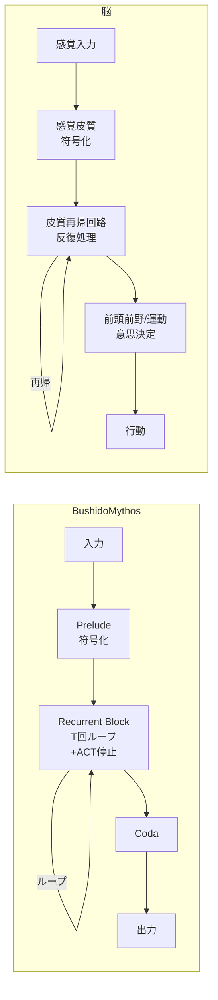
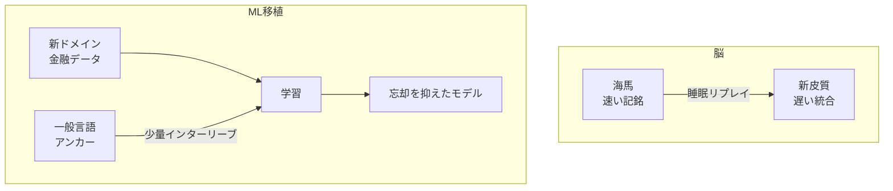
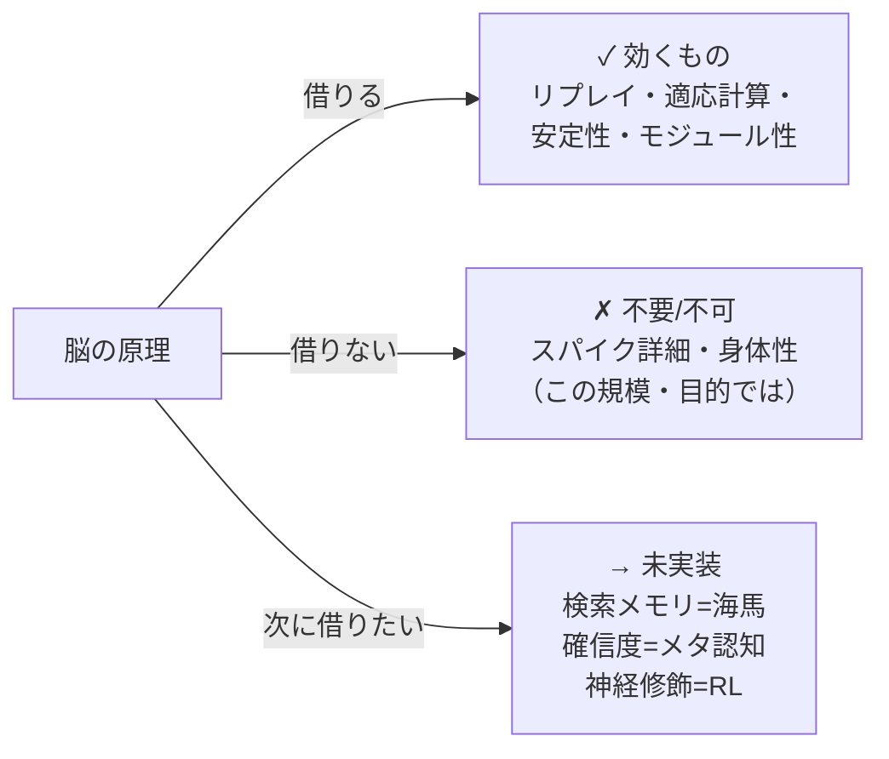

# 脳科学から見た BushidoMythos — どこが「脳的」で、どこが決定的に違うのか

自作の Recurrent-Depth Transformer「BushidoMythos」を作る中で、設計の多くが**脳の計算原理**と重なっていることに気づいた。一方で「脳のモデル」と呼ぶには**決定的に違う**部分もある。本記事はその対応関係と相違を、図と表で整理する。

:::note info
アナロジーは設計の指針としては有効だが、**文字通りの等価ではない**。「脳がこうだから AI もこうすべき」ではなく、「脳のこの原理は、この問題に効く」という使い方をしている。
:::

---

## 全体像:3 段アーキテクチャ ↔ 脳の処理階層

BushidoMythos は **Prelude(入力符号化)→ Recurrent Block（同じ層を T 回ループ）→ Coda（出力）** の3段構成。再帰ループが「深く考える」部分にあたる。

層を**積み上げる**のではなく、少数の層を**何度も巡回**させて深さを得る——これは皮質の**再帰結合(recurrent connectivity)**による反復的処理に近い発想だ。

---

## 表1:似ているところ（脳から借りた原理）

| 脳の機構 | BushidoMythos の対応 | 対応の強さ |
|---|---|---|
| 皮質の**再帰処理**（反復で表現を洗練） | Recurrent-Depth ループ | ★★★ |
| **証拠蓄積→閾値で決定**（drift-diffusion model） | ACT（適応的計算時間）による早期停止 | ★★★ |
| **機能的モジュール性**（領野・コラム） | MoE（専門家の疎なルーティング） | ★★☆ |
| **安定したアトラクタ動態**（暴走しない） | LTI 制約でスペクトル半径 ρ(A) < 1 を保証 | ★★☆ |
| **位相コーディング**（theta-gamma で順序） | ループ index 埋め込み（各反復に位相信号） | ★★☆ |
| **補完学習系 / 睡眠リプレイ**（海馬→新皮質） | 記憶リプレイ（一般言語を学習中に再生） | ★★★ |

最後の「記憶リプレイ」は実際に実装し、破滅的忘却を抑制できた（後述）。

---

## 表2:決定的に違うところ（借りられない／借りていない部分）

| 観点 | 脳 | BushidoMythos |
|---|---|---|
| **学習則** | 局所的可塑性（Hebb/STDP）・予測符号化。各シナプスが局所情報で更新 | **大域 backprop**。全層に誤差を逆伝播（生物学的には非現実的） |
| **神経修飾** | ドーパミン（報酬予測誤差）・ノルアドレナリン（不確実性ゲイン）等で学習率・利得を動的制御 | **なし**。学習率は外部スケジュール、利得は固定 |
| **時間構造** | 連続時間・スパイク・非同期・常時オン | **離散ステップ・同期・前向き1パス**。ループも整数回 |
| **身体性** | 知覚-運動ループ、環境との相互作用の中で学習 | **なし**。テキストのみ、世界と相互作用しない |
| **記憶** | 海馬による**真のエピソード記憶**（一度で記銘・索引） | **パラメトリック記憶のみ**。事実の即時記銘・検索は不得手 |
| **エネルギー** | 約 **20W** で生涯動作 | 学習に GPU 数百W〜。桁違いに非効率 |
| **発達と可塑性** | 生涯にわたり再配線・適応 | 学習後は**固定**（追加学習で破滅的忘却） |

---

## 具体例:脳の原理を ML に移植する（記憶リプレイ）

「補完学習系（CLS）」では、海馬が新しい経験を素早く覚え、**睡眠中にそれを新皮質へリプレイ**して既存知識との干渉を防ぐ。これを ML に移植——学習中に**一般言語データを少量インターリーブ**——したところ、金融特化による破滅的忘却を大きく抑えられた。

| 条件 | 汎用 PPL（低いほど良い） |
|---|---|
| リプレイなし | 大きく劣化 |
| 一般言語リプレイ 20% | 劣化を大幅に抑制 |

> 脳が睡眠中にやっていること（リプレイによる記憶固定）の、ごく単純な近似でも効いた。詳細は別記事「LLM の破滅的忘却を防ぐ（実験）」を参照。

---

## なぜ「違い」を意識すると設計が良くなるか

脳と AI の**対応と相違を区別**すると、次の一手が見えてくる。

- **借りるべき**:破滅的忘却対策（リプレイ）、計算の動的配分（ACT）、安定性（LTI）。脳でも ML でも実績がある。
- **借りない**:スパイクの生物物理や身体性は、この目的（金融テキスト推論）では費用対効果が低い。
- **次に借りたい**:海馬の**検索メモリ**（事実の信頼性）、**メタ認知の確信度**（リスク説明）、**神経修飾＝強化学習**（良い意思決定そのもの）。

---

## まとめ

| | 脳 | BushidoMythos |
|---|---|---|
| 再帰・反復処理 | ◎ | ◎（ループ） |
| 適応的計算 | ◎ | ◎（ACT） |
| モジュール特化 | ◎ | ○（MoE） |
| 記憶リプレイ | ◎ | ○（実装・検証済み） |
| 局所学習則 | ◎ | ✗（backprop） |
| 神経修飾 | ◎ | ✗ |
| 身体性・連続時間 | ◎ | ✗ |
| エネルギー効率 | ◎（20W） | ✗（数百W） |

BushidoMythos は「脳のモデル」ではない。だが**脳の計算原理を選択的に借りる**ことで、忘却・推論深度・安定性といった実問題に効く設計ができる。重要なのは、**何を借り、何を借りないかを意識的に選ぶ**ことだ。

> 推奨タグ：`機械学習` `計算論的神経科学` `LLM` `深層学習` `Transformer`
