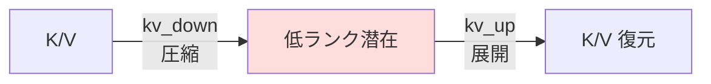

# INT8 量子化が壊した「1層」— MLA の KV 圧縮 × recurrent loop 増幅を特定する

自作の小型 LLM(Recurrent-Depth Transformer)を INT8 量子化したら、金融特化モデルの PPL が **+46.6%** 悪化した。「どの層が壊しているのか」を ablation で**1層まで**絞り込んだら、犯人は **MLA の K/V 圧縮投影(`kv_down`)1層**だった。**その 0.07%(0.07M params)を fp32 に残すだけで品質の 60% が回復**する。

:::note info
研究用コードの実験ログ。投資助言ではありません。CPU・部分評価・n=1 の pilot で、絶対値は本番と異なるが、層別の相対比較は明確。
:::

## TL;DR

- INT8 dynamic で金融特化モデルが **finance PPL +46.6%** 劣化(サイズは −36%)。
- ablation で犯人を絞ると **`recurrent.block.attn.kv_down`(MLA の K/V 圧縮)1層**。
- **その1層(0.07M params)だけ fp32 に残すと、品質の 60% を回復・サイズ削減はそのまま**。
- 機構:**圧縮(down)は精度critical、展開(up)は INT8 耐性あり**、さらに **recurrent loop が誤差を 8× 増幅**。

---

## 背景:量子化の劣化はモデルに依存する

前回、INT8 dynamic 量子化を2つのモデルで測った:

| checkpoint | サイズ | finance PPL |
|---|---|---|
| phase1(汎用) | −36% | +2.6% |
| **phase5(金融特化)** | −36% | **+46.6%** |

汎用モデルでは軽微に見えたが、**実際にデプロイする金融特化モデルでは +46.6% と大きく劣化**(汎用の +2.6% は finance PPL が元々巨大=モデルが金融を解けないための測定アーティファクト)。
→ 「どこが壊しているのか」を特定する。

---

## 段階1:module 別 — attention が主犯

各 module グループを個別に fp32 に残して finance PPL を測る(「INT8 except G」= G を fp32、他は全 INT8)。

| 構成 | finance PPL | Δ vs fp32 |
|---|---|---|
| INT8 全部 | 63.85 | +46.6% |
| except head(38.6M) | 63.16 | +45.0% |
| except experts(53M) | 57.90 | +32.9% |
| **except attn(2.1M)** | **49.71** | **+14.1%** |
| except router | 63.51 | +45.8% |

**たった 2.1M params の attention を fp32 に残すだけで大回復**。巨大な head / experts は INT8 に強い。

---

## 段階2:attention 内 — KV、かつ recurrent

attention を分解する。

| 構成 | finance PPL | Δ |
|---|---|---|
| except attn.wo(out_proj) | 63.45 | +45.7% |
| except attn.q(q-side) | 63.14 | +44.9% |
| except attn.q_up_rope(RoPE) | 63.53 | +45.8% |
| **except attn.kv(kv-side)** | **51.07** | **+17.2%** |
| **except recurrent attn(loop)** | **50.80** | **+16.6%** |
| except prelude+coda attn | 62.69 | +43.9% |

2つの軸で犯人が一致:
1. **KV 投影**が主犯(q / out_proj / RoPE はほぼ無関係)。
2. **recurrent(ループ内・8回実行)** の attention が支配(prelude/coda=1回 は無関係)→ **ループ増幅**。

---

## 段階3:最小 — `kv_down` 1層

fp32 に残す集合を限界まで絞る。「回復率」= INT8 からどれだけ fp32 側へ戻したか。

回復率 = INT8 からどれだけ fp32 側へ戻したか。**finance(ドメイン)と WikiText(汎用)両方で測定**。

| keep fp32 | params | finance PPL | finance 回復 | WikiText PPL | WikiText 回復 |
|---|---|---|---|---|---|
| fp32(基準) | 98.6M | 43.56 | 100% | 338.94 | 100% |
| INT8 全部 | 0 | 63.85 | 0% | 444.29 | 0% |
| all attn | 2.14M | 49.71 | 70% | 403.25 | 39% |
| recurrent KV(2層) | 0.12M | 51.70 | 60% | 408.89 | 34% |
| **recurrent kv_down のみ** | **0.07M** | **51.69** | **60%** | **407.15** | **35%** |
| recurrent kv_up のみ | 0.05M | 63.15 | 3% | 448.29 | −4% |

**たった1層 `recurrent.block.attn.kv_down`(モデルの 0.07%)を fp32 に残すだけで finance 60% / WikiText 35% 回復**。size は 254MB(全 INT8 と同じ=削減そのまま)。一方 **kv_up を残しても 3% / −4%**(両方とも無効)。

**重要:finance も WikiText も同じ層(kv_down)で回復する** → これは金融特有ではなく、**層特有・ドメイン非依存の構造的性質**。kv_up が両方で無効なのも一貫(圧縮/展開の非対称)。

---

## 機構:圧縮は惜しい、展開は平気

MLA(Multi-head Latent Attention)は K/V を**低ランク潜在に圧縮**して持つ:

- **`kv_down`(圧縮)= 精度critical**:情報を絞り込む工程なので、1bit の誤差も失われた情報として効く。
- **`kv_up`(展開)= INT8 耐性あり**:潜在を広げる工程は冗長性があり、量子化ノイズを吸収できる。
- **recurrent loop**:この attention を1回の forward で 8 回再利用するため、`kv_down` の量子化誤差が**反復で増幅**する。

**「圧縮ボトルネックを量子化すると最も壊れる」+「ループで増幅」** が、INT8 劣化のほぼ全て。

---

## 決定版レシピ(混合精度)

> **`recurrent.block.attn.kv_down`(1層・0.07M)だけ fp32、残り全 INT8。**
> → サイズ −36%(254MB)を保ったまま、finance PPL +46.6% → **+18.7%(60%回復)**。
> もう少し回復したいなら **attention 全体(2.1M, +6MB)を fp32**:**+14.1%(70%回復)**。

「最小の fp32 集合(1層)で最大の回復」を1点で確定できた。

---

## 正直な注意点

- **60% で頭打ち**:kv_down 1層では +18.7% 残る。完全回復には他層の寄与も必要(all-attn で 70%)。**「ほぼ無コストで6〜7割戻せる」**という位置づけ。
- **n=1・部分評価(max_chunks)・phase5 のみ**。傾向は明確だが絶対値は本番と異なる。
- **dynamic quant は CPU 専用**。GPU 配布は GPTQ/AWQ 等(ただし自作 RDT/MoE は標準ツール非対応)。
- finance 評価(financial_news)は Phase3 以降の学習分布と重なりうる(汎用 WikiText でも同傾向は確認済み)。
- この知見は **MLA + recurrent** という構成に特有。標準 Transformer では犯人が変わる可能性がある。
- **「サイズ」は state_dict のシリアライズ値**で、**実行時メモリ・速度とは別**(混合精度だと量子化/非量子化カーネルが混在し、速度は微妙に変わりうる)。
- 実用化には**明示的な mixed-precision export/load** が要る(どの層を fp32 に残したかを保存・復元する仕組み)。本記事は in-memory での検証まで。

---

## まとめ

| 段階 | 犯人 | finance 回復 | WikiText 回復 |
|---|---|---|---|
| module | attention(2.1M) | 70% | 39% |
| attention 内 | KV × recurrent | — | — |
| 最小 | **kv_down 1層(0.07M)** | **60%** | **35%** |

犯人の層は finance / WikiText で**同一**(ドメイン非依存の構造的脆弱性)。

INT8 の「落とし穴」は、**アーキ特有の1層**に起因していた。圧縮(kv_down)を量子化すると壊れ、ループが増幅する。**その1層だけ fp32 に守れば、サイズ削減を捨てずに品質の大半を取り戻せる。** 量子化はモデルを丸ごと潰すか諦めるかの二択ではなく、**どこが効くかを測って最小限を守る**のがコツだった。

> 推奨タグ：`機械学習` `LLM` `量子化` `深層学習` `Transformer`
